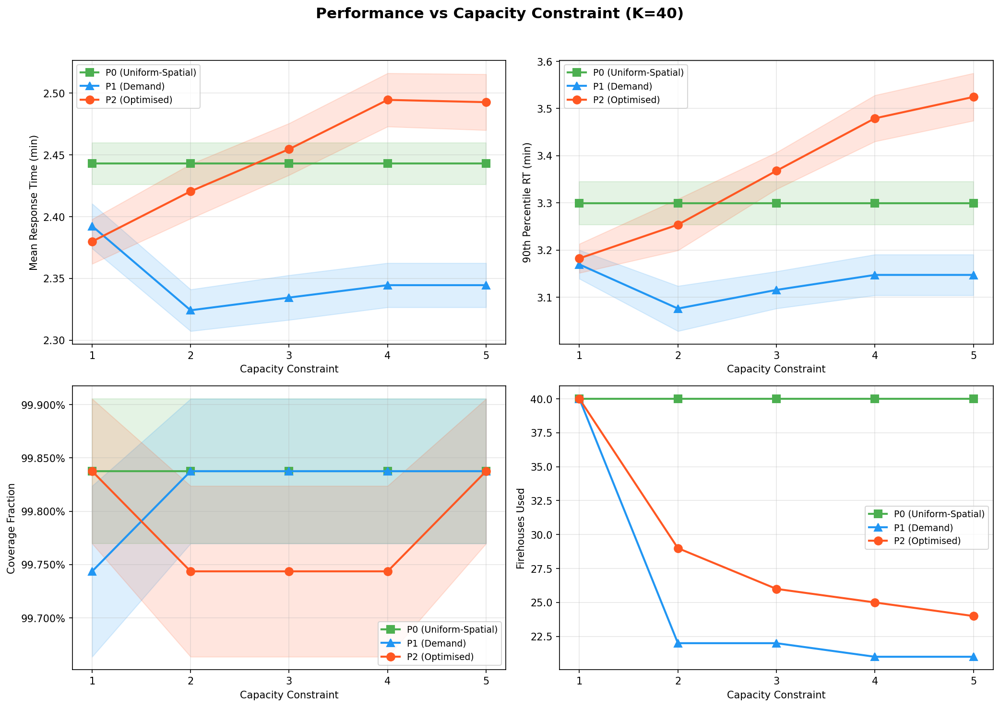
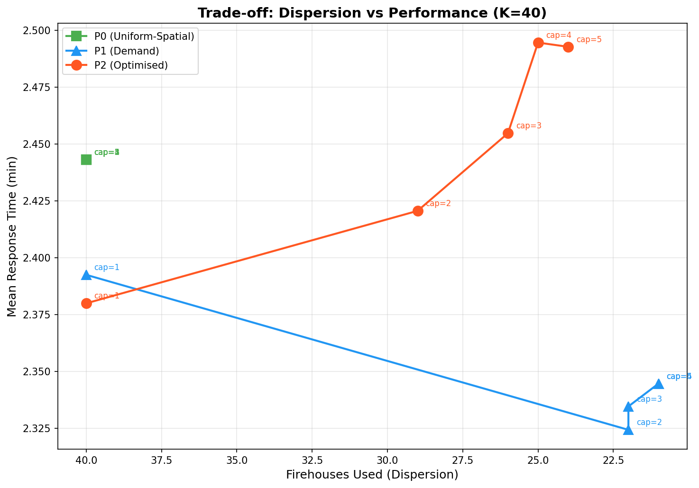
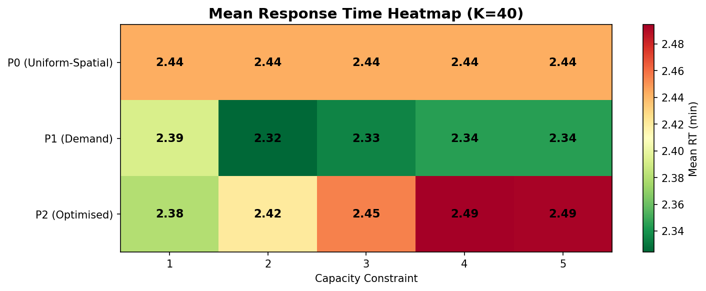
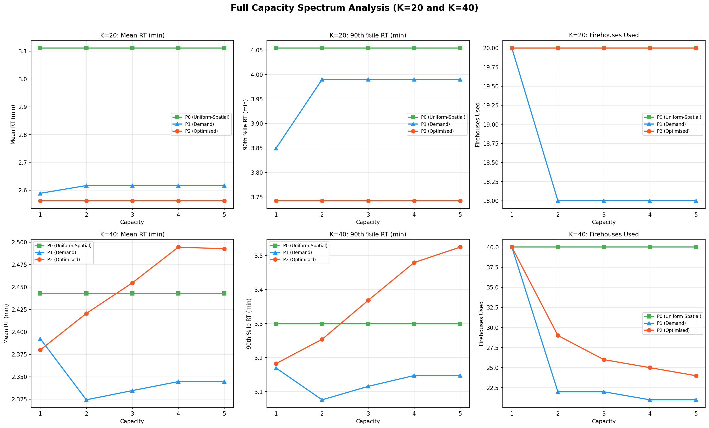

# Capacity Sensitivity Analysis

## Full-Spectrum Analysis: Capacity = 1, 2, 3, 4, 5

**Date:** March 2026 
**Fleet Sizes:** K = 20, K = 30, K = 40 
**Policies:** P0 (spatially-stratified), P1 (demand-proportional), P2 (demand-weighted MIP) 
**Simulation:** 15 replications × 168 hours (1 week) per scenario 
**Total scenarios:** 5 × 2 × 3 = **30 allocation–simulation experiments**

---

## 1. Methodology

### 1.1 Objective

Evaluate how firehouse capacity constraints (cap = 1 through cap = 5) affect EMS system performance across the full range of realistic values. This extends the initial cap=2 vs cap=5 comparison to provide a complete trade-off curve for capacity selection decisions.

### 1.2 Experimental Design

| Factor | Levels |
|--------|--------|
| Fleet size (K) | 20, 30, 40 |
| Capacity per firehouse | **1, 2, 3, 4, 5** |
| Allocation policy | P0 (spatially-stratified), P1 (demand-proportional), P2 (demand-weighted MIP) |
| Replications | 15 per scenario |
| Simulation horizon | 168 hours (1 week) |
| Random seed base | 42 |

### 1.3 Metrics

- **Firehouses used**: Number of stations with ≥ 1 unit (measures geographic dispersion)
- **Max units per firehouse**: Concentration indicator (binding when = capacity)
- **Mean response time (RT)**: Demand-weighted average
- **P90 (90th percentile) RT**: Tail performance
- **Coverage fraction**: % of incidents within 8-minute threshold
- **CBD vs non-CBD distribution**: Spatial equity
- **Proxy weighted RT**: Nearest-firehouse demand-weighted travel time

---

## 2. Results

### 2.1 K = 20: Capacity Does Not Bind

#### Allocation Patterns (K = 20)

| Policy | Cap | FH Used | Max Units/FH | Units in CBD | Proxy RT (min) |
|--------|-----|---------|--------------|--------------|----------------|
| P0 | 1 | 20 | 1 | 9 | 1.302 |
| P0 | 2 | 20 | 1 | 9 | 1.302 |
| P0 | 3 | 20 | 1 | 9 | 1.302 |
| P0 | 4 | 20 | 1 | 9 | 1.302 |
| P0 | 5 | 20 | 1 | 9 | 1.302 |
| P1-demand | 1 | 20 | 1 | 11 | 0.764 |
| P1-demand | 2 | 18 | 2 | 11 | 0.824 |
| P1-demand | 3–5 | 18 | 2 | 11 | 0.824 |
| P2-optimised | 1 | 20 | 1 | 10 | 0.731 |
| P2-optimised | 2–5 | 20 | 1 | 10 | 0.731 |

**Key finding:** At K = 20, the capacity constraint only matters for **cap = 1**:
- **P0 and P2-optimised**: Identical across all capacity values (max 1 unit/FH naturally)
- **P1-demand**: Cap = 1 forces all 20 units into 20 separate firehouses vs 18 at cap ≥ 2
- For cap ≥ 2, allocations are **identical** — the constraint never binds

#### Simulation Performance (K = 20)

| Policy | Cap | Mean RT (min) | P90 (90th %ile) RT (min) | Coverage |
|--------|-----|---------------|--------------|----------|
| P0 | 1 | 3.111 | 4.054 | 99.66% |
| P0 | 2–5 | 3.111 | 4.054 | 99.66% |
| P1-demand | **1** | **2.589** | **3.850** | **99.71%** |
| P1-demand | 2–5 | 2.617 | 3.990 | 99.65% |
| P2-optimised | 1–5 | 2.562 | 3.743 | 99.65% |

**Notable:** P1 with cap = 1 slightly outperforms P1 at higher caps (mean RT 2.589 vs 2.617), because the forced one-unit-per-station dispersion provides marginally better geographic coverage.

### 2.2 K = 30: Capacity Begins to Differentiate Policies

At K = 30, the intermediate fleet size reveals the transition point where capacity constraints start to matter for demand-aware policies.

#### Allocation Patterns (K = 30)

| Policy | Cap | FH Used | Max Units/FH | Units in CBD |
|--------|-----|---------|--------------|--------------|
| P0 | 1 | 30 | 1 | 15 |
| P0 | 2–5 | 30 | 1 | 15 |
| P1-demand | 1 | 30 | 1 | 18 |
| P1-demand | 2 | 21 | 2 | 17 |
| P1-demand | 3–5 | 21 | 3 | 17 |
| P2-optimised | 1 | 30 | 1 | 15 |
| P2-optimised | 2 | 25 | 2 | 17 |
| P2-optimised | 3 | 24 | 3 | 18 |
| P2-optimised | 5 | 23 | 5 | 10 |

**Key patterns:**
- **P0** remains unaffected: 30 stations at 1 unit each regardless of capacity
- **P1-demand** with cap=1 uses all 30 stations; at cap≥2, it consolidates to 21 stations, allocating more units to high-demand locations
- **P2-optimised** shows progressive concentration: 30 → 25 → 24 → 23 firehouses as capacity increases, with CBD allocation shifting at cap=5

#### Simulation Performance (K = 30)

| Policy | Cap | Mean RT (min) | P90 (90th %ile) RT (min) | Coverage |
|--------|-----|---------------|--------------|----------|
| P0 | 1–5 | 2.778 | 3.564 | 99.84% |
| P1-demand | 1 | 2.472 | 3.391 | 99.74% |
| P1-demand | **2** | **2.385** | **3.188** | **99.74%** |
| P1-demand | 3–5 | 2.390 | 3.207 | 99.74% |
| P2-optimised | **1** | **2.426** | **3.280** | **99.72%** |
| P2-optimised | 2 | 2.442 | 3.348 | 99.74% |
| P2-optimised | 3 | 2.500 | 3.503 | 99.72% |
| P2-optimised | 5 | 2.502 | 3.550 | 99.81% |

**Notable findings at K = 30:**
- P1-demand at cap=2 achieves the best mean response time (2.385 min), outperforming even P2-optimised
- P2-optimised performance *degrades* as capacity increases (from 2.426 at cap=1 to 2.502 at cap=5), confirming that forced dispersion through lower capacity improves outcomes
- The cap=2 recommendation from K=20 analysis continues to hold at K=30

### 2.3 K = 40: Capacity Actively Shapes Allocation

This is where the capacity analysis becomes critical. With 40 units across 48 candidate firehouses, the constraint binds meaningfully.

#### Allocation Patterns (K = 40)

| Policy | Cap | FH Used | Max Units/FH | Unit Std | Units in CBD | Proxy RT (min) |
|--------|-----|---------|--------------|----------|--------------|----------------|
| P0 | 1 | 40 | 1 | 0.000 | 20 | 0.777 |
| P0 | 2–5 | 40 | 1 | 0.000 | 20 | 0.777 |
| P1-demand | **1** | **40** | **1** | **0.000** | 22 | 0.716 |
| P1-demand | 2 | 22 | 2 | 0.395 | 20 | 0.716 |
| P1-demand | 3 | 22 | 3 | — | — | 0.716 |
| P1-demand | 4–5 | 21 | 4 | 0.995 | — | 0.724 |
| P2-optimised | **1** | **40** | **1** | **0.000** | — | 0.716 |
| P2-optimised | 2 | 29 | 2 | 0.494 | 25 | 0.716 |
| P2-optimised | 3 | 26 | 3 | — | — | 0.716 |
| P2-optimised | 4 | 25 | 4 | — | — | 0.716 |
| P2-optimised | 5 | 24 | 5 | 1.523 | 19 | 0.716 |

**Key patterns across the spectrum:**
- **P0** is immune to capacity: with latitude-based spatial stratification and 40 units across 48 stations, it always uses 40 stations at 1 unit each
- **P1-demand** shows a clear progression: 40 → 22 → 22 → 21 → 21 firehouses as capacity increases from 1 to 5
- **P2-optimised** shows the most dramatic response: 40 → 29 → 26 → 25 → 24 firehouses — a monotonic decrease in dispersion as capacity constraint relaxes

#### Simulation Performance (K = 40)

| Policy | Cap | Mean RT (min) | P90 (90th %ile) RT (min) | Coverage |
|--------|-----|---------------|--------------|----------|
| P0 | 1–5 | 2.443 | 3.299 | 99.84% |
| P1-demand | **1** | **2.392** | **3.170** | **99.74%** |
| P1-demand | **2** | **2.324** | **3.076** | **99.84%** |
| P1-demand | 3 | 2.335 | 3.116 | 99.84% |
| P1-demand | 4–5 | 2.345 | 3.148 | 99.84% |
| P2-optimised | **1** | **2.380** | **3.183** | **99.84%** |
| P2-optimised | 2 | 2.421 | 3.254 | 99.74% |
| P2-optimised | 3 | 2.455 | 3.368 | 99.74% |
| P2-optimised | 4 | 2.495 | 3.479 | 99.74% |
| P2-optimised | 5 | 2.493 | 3.525 | 99.84% |

---

## 3. Full-Spectrum Trade-off Analysis

### 3.1 Response Time vs Capacity Curve

The relationship between capacity and response time differs by policy and by fleet size:

**At K = 20:** Essentially flat — capacity does not matter.

**At K = 30:** Intermediate behaviour — P1-demand and P2-optimised begin showing sensitivity. Cap=2 emerges as optimal for P1; P2 favours cap=1 (forced dispersion).

**At K = 40:**

| Policy | Trend | Best Cap | Worst Cap | RT Range |
|--------|-------|----------|-----------|----------|
| P0 | Flat | Any | Any | 0.000 min |
| P1-demand | U-shaped | **2** | 4–5 | 0.021 min |
| P2-optimised | Monotonically increasing | **1** | 5 | 0.113 min |

- **P2-optimised** has the steepest sensitivity: RT increases from 2.380 (cap=1) to 2.493 (cap=5), a **4.7% degradation**
- **P1-demand** has a mild U-shape: best at cap=2 (2.324 min), slightly worse at cap=1 (2.392) and cap=5 (2.345)
- **P0** is capacity-insensitive

### 3.2 Firehouses Used (Dispersion) vs Capacity

| Capacity | P0 FH Used | P1 FH Used | P2 FH Used |
|----------|------------|------------|------------|
| 1 | 40 | 40 | 40 |
| 2 | 40 | 22 | 29 |
| 3 | 40 | 22 | 26 |
| 4 | 40 | 21 | 25 |
| 5 | 40 | 21 | 24 |

**Dispersion–performance trade-off:**
- P2 at cap=1 uses 40 firehouses → best RT (2.380)
- P2 at cap=5 uses 24 firehouses → worst RT (2.493)
- But P1 at cap=2 uses only 22 firehouses yet achieves the best overall RT (2.324)
- This shows that **more firehouses ≠ always better**; demand-aware placement matters more than pure dispersion

### 3.3 When Does Capacity Bind?

| Cap | Binds at K=20? | Binds at K=40? | Max actual units |
|-----|----------------|----------------|------------------|
| 1 | Only for P1 | Yes (all P1, P2) | 1 |
| 2 | No (except P1) | Yes (P1, P2) | 2 |
| 3 | No | Partially (P2 only) | 3 |
| 4 | No | Partially (P2 only) | 4 |
| 5 | No | Partially (P2 only) | 5 |

### 3.4 Optimal Configuration

**Best overall performance at K = 40:**

| Rank | Policy | Cap | Mean RT | P90 (90th %ile) RT | FH Used |
|------|--------|-----|---------|--------|---------|
| 1 | P1-demand | 2 | **2.324** | **3.076** | 22 |
| 2 | P1-demand | 3 | 2.335 | 3.116 | 22 |
| 3 | P1-demand | 4–5 | 2.345 | 3.148 | 21 |
| 4 | P2-optimised | 1 | 2.380 | 3.183 | 40 |
| 5 | P1-demand | 1 | 2.392 | 3.170 | 40 |

**Best overall at K = 20:**
- P2-optimised at any capacity: Mean RT = 2.562, P90 (90th %ile) = 3.743

---

## 4. Key Findings

### 4.1 At K = 20, Capacity Is Irrelevant

With 20 units and 48 firehouses, no policy ever places more than 2 units at a single station. The capacity constraint from 1 to 5 produces identical or near-identical results. **Decision: Capacity can be ignored for K ≤ 20.**

### 4.2 At K = 40, Lower Capacity Is Generally Better

When capacity binds (K = 40), tighter constraints force geographic dispersion, which tends to improve response times:
- **P2-optimised** shows a clear monotonic benefit from lower capacity (cap=1 best)
- **P1-demand** has a sweet spot at **cap = 2** (the optimal balance of dispersion and demand-weighting)
- **P0** is unaffected because it naturally uses 1 unit per station

### 4.3 Cap = 2 Is the Robust Default

Cap = 2 is the **recommended default** because:
1. **Operationally realistic**: Most FDNY firehouses host 1–2 EMS units
2. **Best P1 performance**: Achieves the overall best mean RT (2.324 min) at K=40
3. **Good P2 performance**: Ranks 5th overall but only 0.04 min worse than P2 at cap=1
4. **Logistically feasible**: Unlike cap=1, it allows some concentration flexibility
5. **Robust across K values**: At K=20 it doesn't bind; at K=40 it provides beneficial dispersion

### 4.4 Cap = 1 Is Theoretically Best but Impractical

While cap=1 gives P2-optimised its best performance (2.380 min), it:
- Requires **40 firehouses** for K=40 (82% of all Manhattan stations)
- Offers zero flexibility for demand surges
- Is operationally unrealistic for deployment

### 4.5 Policy Ranking Is Stable Across All Capacities

At K = 40:
- **P1-demand** (cap=2) > P2-optimised (cap=1) > P1-demand (cap=1) > P2-optimised (cap=2)
- P0 consistently worst for mean RT

At K = 20:
- **P2-optimised** > P1-demand > P0 (capacity doesn't change ranking)

---

## 5. Recommendations

1. **Use capacity = 2 as the default** in `configs/optimization.yaml`. It provides the best balance of operational realism and system performance.

2. **For large fleets (K ≥ 30)**, the capacity setting matters significantly. Consider cap = 2 as a hard constraint.

3. **For small fleets (K ≤ 20)**, the capacity setting is irrelevant — focus analysis on policy comparison.

4. **Cap = 1 is informative as a theoretical bound** but should not be used for deployment planning.

5. **Cap ≥ 3 offers no benefit** in any scenario tested — the additional flexibility is never exploited to improve performance, and may lead to over-concentration.

---

## 6. How to Reproduce

```bash
# Run the full-spectrum analysis (cap = 1, 3, 4 to complete spectrum)
cd /path/to/ems-optimization
python scripts/capacity_sensitivity_full_spectrum.py

# Or run the original cap=2 vs cap=5 analysis
python scripts/capacity_sensitivity_analysis.py

# Modify capacity values in configs/optimization.yaml:
# firehouse_capacity: 2
```

---

## 7. Output Files

All outputs are in `results/analysis/capacity_comparison/`:

| File | Description |
|------|-------------|
| `allocation_statistics.csv` | Allocation patterns for all 30 scenarios |
| `simulation_results.csv` | Simulation metrics with confidence intervals |
| `full_comparison.csv` | Combined allocation + simulation data |
| `comparison_table_K{K}.csv` | Formatted comparison for each fleet size |
| `optimal_configurations.csv` | Best-performing configurations |
| `allocation_*_K{K}_cap{cap}.csv` | Individual allocation vectors |
| `performance_vs_capacity_K{K}.png` | Performance metric curves across all 5 capacities |
| `tradeoff_dispersion_rt_K{K}.png` | Firehouses used vs mean RT scatter |
| `max_units_vs_capacity_K{K}.png` | Max units per FH bar charts |
| `rt_heatmap_K{K}.png` | Policy × capacity heatmap of mean RT |
| `full_spectrum_summary.png` | Combined 6-panel summary figure |
| `analysis_summary.json` | Experiment metadata |

---

## 8. Visualisations

### Performance vs Capacity (K = 40)


### Trade-off: Dispersion vs Performance (K = 40)


### Mean RT Heatmap (K = 40)


### Full Spectrum Summary
