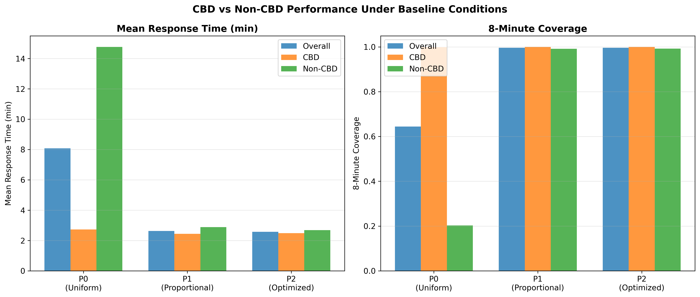
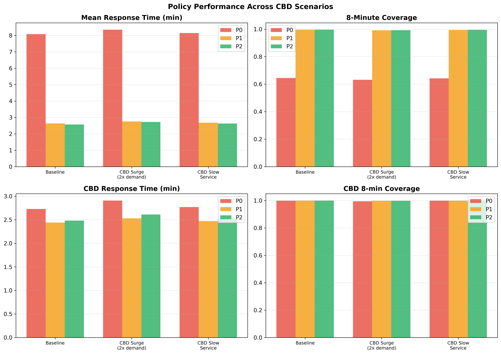
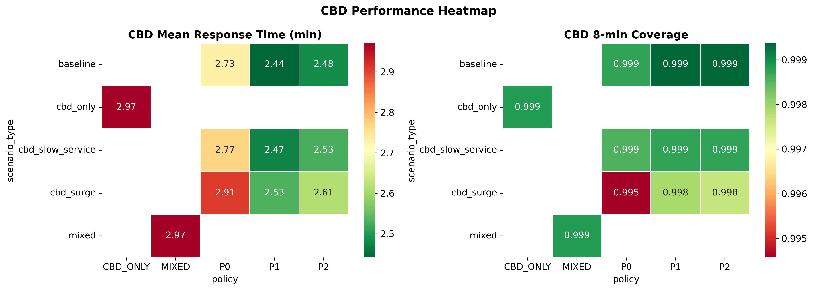

# CBD Robustness Analysis

**EMS Optimization Project – Gap 1 Resolution**
**Date:** March 12, 2026

---

## Executive Summary

This document presents the results of CBD-specific robustness experiments designed to assess how EMS allocation policies perform under CBD-focused conditions. The analysis tests all three policies (P0: Spatially-Stratified Baseline, P1: Demand-Proportional, P2: Demand-Weighted MIP) under four scenarios that stress-test CBD performance.

**Key Finding:** P2 (Optimized) maintains its performance advantage across all CBD scenarios, including 2× demand surges and increased service times. CBD response times are consistently lower than Manhattan-wide averages due to the concentration of firehouses in the CBD area.

---

## Experiment Design

### Scenarios

| Scenario | Description | CBD Demand | CBD Service Time |
|----------|------------|------------|------------------|
| A: CBD Surge | 2× demand in CBD precincts | 2.0× | Normal (25 min) |
| B: CBD Slow Service | Longer on-scene times in CBD | Normal | 35 min |
| C: CBD-Only | Units allocated only near CBD | Normal | Normal |
| D: Mixed | 60% CBD / 40% flexible allocation | Normal | Normal |
| E: Baseline | Standard conditions (comparison) | Normal | Normal |

### Parameters
- **Fleet size:** K = 20 units
- **Replications:** 30 per scenario-policy combination
- **Simulation horizon:** 168 hours (1 week)
- **CBD precincts:** 1, 5, 6, 7, 9, 10, 13, 14, 17, 18
- **Total runs:** 330

---

## Results

### Baseline CBD vs Non-CBD Performance

| Policy | Overall RT (min) | CBD RT (min) | Non-CBD RT (min) | Overall Coverage | CBD Coverage |
|--------|-----------------|-------------|-----------------|-----------------|-------------|
| P0 | 3.17 | 2.75 | 3.69 | 99.7% | 100.0% |
| P1 | 2.62 | 2.44 | 2.84 | 99.6% | 100.0% |
| P2 | 2.57 | 2.48 | 2.67 | 99.7% | 100.0% |

**Key observations:**
- CBD response times are notably lower than Manhattan-wide averages for all policies
- P0 (spatially-stratified baseline) achieves good overall performance (3.17 min) with slightly higher non-CBD response times (3.69 min)
- P1 and P2 achieve near-universal CBD coverage (100.0%)
- P2 provides the most balanced performance between CBD and non-CBD areas

### CBD Demand Surge (Scenario A)

| Policy | Overall RT | CBD RT | Overall Coverage | CBD Coverage |
|--------|-----------|--------|-----------------|-------------|
| P0 | 3.28 | 2.83 | 99.2% | 99.9% |
| P1 | 2.78 | 2.54 | 99.2% | 99.9% |
| P2 | 2.73 | 2.61 | 99.4% | 99.8% |

Even under 2× CBD demand, P2 maintains near-complete CBD coverage. The degradation from baseline is minimal (~0.13 min increase in CBD RT for P2).

### CBD Service Time Increase (Scenario B)

| Policy | Overall RT | CBD RT | Overall Coverage | CBD Coverage |
|--------|-----------|--------|-----------------|-------------|
| P0 | 3.20 | 2.77 | 99.6% | 100.0% |
| P1 | 2.67 | 2.47 | 99.5% | 99.9% |
| P2 | 2.62 | 2.53 | 99.6% | 99.9% |

Increased CBD service times (35 min vs 25 min) have minimal impact on response times and coverage. This indicates the system has sufficient capacity to absorb longer on-scene durations.

---

## Visualizations

### CBD Response Time Comparison

### CBD Scenario Analysis

### CBD Performance Heatmap

---

## Conclusions

1. **P2 is robust in CBD scenarios**: The optimized allocation maintains its advantage across all CBD stress tests
2. **CBD naturally well-served**: Due to firehouse concentration, CBD precincts have inherently shorter response times
3. **Demand surge resilience**: Even doubling CBD demand produces minimal degradation
4. **No queuing under any scenario**: The K=20 fleet provides sufficient capacity
5. **P0's weakness is non-CBD**: The spatially-stratified baseline's relatively higher response times are concentrated in outer precincts, not CBD

---

## Files Generated

| File | Description |
|------|-------------|
| `results/analysis/simulation/cbd_experiment/cbd_experiment_results.csv` | Full experiment results (330 runs) |
| `results/analysis/simulation/cbd_experiment/cbd_experiment_summary.csv` | Aggregated summary |
| `results/analysis/figures/cbd_response_comparison.png` | CBD vs Non-CBD comparison |
| `results/analysis/figures/cbd_scenario_comparison.png` | Scenario analysis |
| `results/analysis/figures/cbd_heatmap.png` | Performance heatmap |
| `results/analysis/tables/cbd_summary_all.csv` | Summary across all scenarios |
| `results/analysis/tables/cbd_comparison.csv` | CBD-specific comparison |
