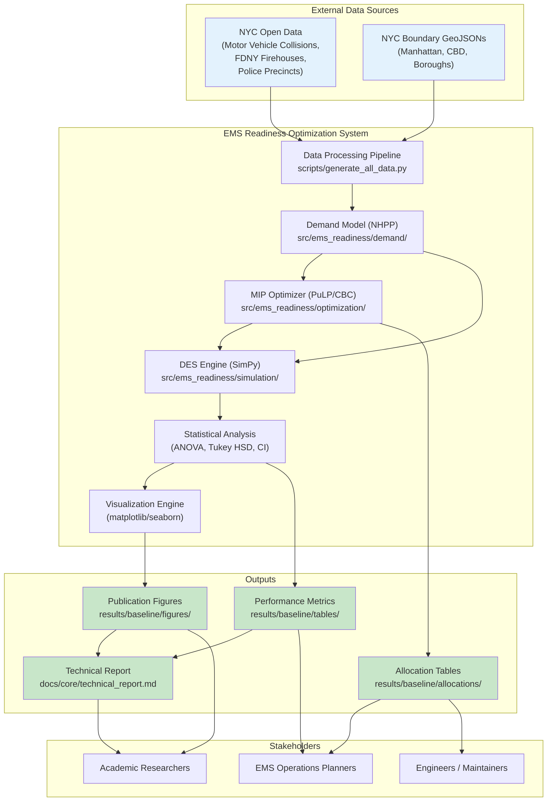
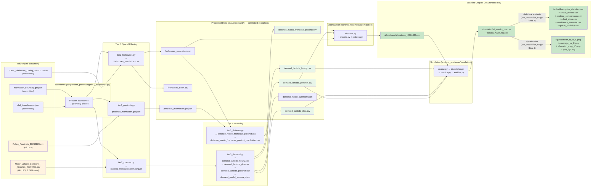
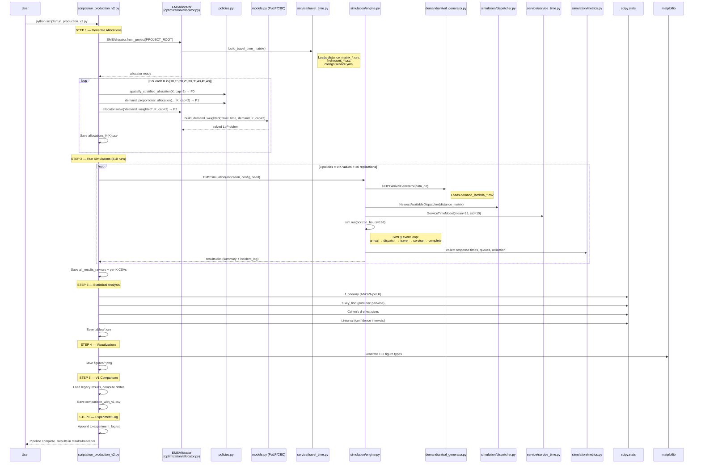
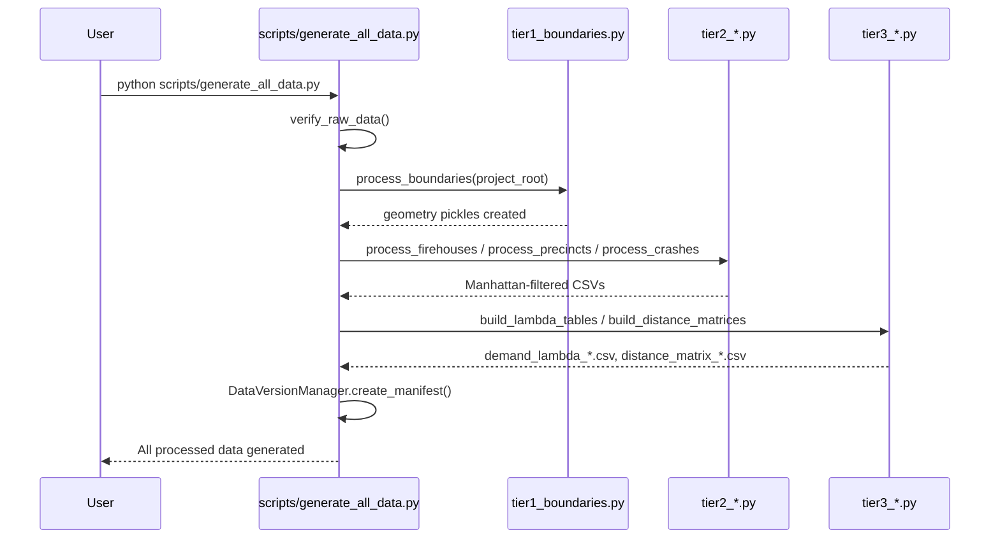

# Architectural Map — EMS Readiness Optimization

> **Generated**: 2026-03-21  
> **Repository**: `ems-optimization/`  
> **Package version**: 0.6.0 (`src/ems_readiness/__init__.py`)  
> **Methodology**: Repository-to-architecture reconstruction. All claims are evidence-based and classified as **Confirmed**, **Inferred**, or **Unknown**.

---

## A. Executive Summary

- **Purpose**: This repository implements a simulation-based approach to optimizing ambulance (EMS) staging locations across Manhattan's 48 FDNY firehouses, aiming to minimize emergency response times. **[Confirmed — `README.md`, `docs/core/technical_report.md`]**
- **Core technique**: Three allocation policies (P0 spatially-stratified baseline, P1 demand-proportional, P2 MIP-optimized) are evaluated via discrete-event simulation (SimPy) with NHPP demand modeling calibrated from 2.24M historical motor vehicle collision records. **[Confirmed — `scripts/run_production_v2.py`, `src/ems_readiness/`]**
- **Key result**: The optimized policy P2 achieves a 19% reduction in mean response time (3.17 → 2.57 min) over P0 at K=20 with capacity=2. **[Confirmed — `README.md`, `results/baseline/tables/descriptive_statistics.csv`]**
- **Canonical pipeline entry point**: `python scripts/run_production_v2.py` — runs allocation generation, 810 simulation runs (3 policies × 9 K values × 30 replications), statistical analysis, and visualization. **[Confirmed — source code inspection]**
- **Data pipeline entry point**: `python scripts/generate_all_data.py` (or `make data`) — processes raw NYC Open Data into demand lambda tables and distance matrices. **[Confirmed — `Makefile`, source code]**
- **Project type**: Batch pipeline (data processing → optimization → simulation → statistical analysis → visualization). Not a service, not notebook-driven. **[Confirmed — no server code, no `setup.py` entry points]**
- **Reproducibility**: Deterministic seeding via `SeedManager` (master seed 42), 30 replications per scenario, all configs in YAML. **[Confirmed — `configs/reproducibility.yaml`, `src/ems_readiness/utils/reproducibility.py`]**
- **Technology stack**: Python 3.11+, PuLP/CBC (MIP solver), SimPy (DES), pandas/numpy/scipy, geopandas, matplotlib/seaborn. **[Confirmed — `requirements.txt`]**
- **Git LFS**: Two large raw CSVs (Motor Vehicle Collisions ~2.2M rows, Police Precincts) are tracked via Git LFS. **[Confirmed — `.gitattributes`]**
- **Results organization**: `results/baseline/` is the canonical source of truth; `results/analysis/` contains supporting robustness/sensitivity analyses; `results/archive/` is legacy (cap=5 era). **[Confirmed — `results/WHICH_FILES_TO_USE.md`]**

---

## B. Repository Execution Map

### What to Run First

**Prerequisite**: Ensure processed data exists. Most processed data files are committed (demand lambdas, distance matrices, firehouses CSVs, precincts GeoJSON). The crash CSV and parquet are `.gitignore`d but are only needed for data regeneration, not for the production pipeline.

| Step | Command | Purpose | Prerequisites | Evidence |
|------|---------|---------|---------------|----------|
| 0 (optional) | `python -m venv venv && source venv/bin/activate && pip install -r requirements.txt` | Create environment | Python 3.11+ | `Makefile` target `setup` |
| 1 (if needed) | `python scripts/generate_all_data.py` or `make data` | Generate processed data from raw | Raw CSV files in `data/raw/` | `scripts/generate_all_data.py` |
| 1a (verify) | `python scripts/generate_all_data.py --verify` or `make verify-data` | Verify processed data exists | None | `Makefile` |
| 2 (**primary**) | `python scripts/run_production_v2.py` | Run full production pipeline | Processed data in `data/processed/` | `scripts/run_production_v2.py` |
| 3 (optional) | `python scripts/run_verification.py` | Run V&V toy scenarios | Processed data | `scripts/run_verification.py` |
| 4 (optional) | `python scripts/run_validation_pilots.py` | Run validation pilots | Processed data | `scripts/run_validation_pilots.py` |
| 5 (optional) | `pytest tests/ -v` or `make test` | Run unit/integration tests | Processed data, full dependencies | `Makefile`, `tests/` |

### Required Inputs Before First Execution

| Input | Path | Status | Notes |
|-------|------|--------|-------|
| Firehouse listing | `data/raw/FDNY_Firehouse_Listing_20260223.csv` | **Committed** | Small file, always present |
| Manhattan boundary | `data/raw/manhattan_boundary.geojson` | **Committed** | Geometry file |
| CBD boundary | `data/raw/cbd_boundary.geojson` | **Committed** | For CBD analyses |
| NYC borough boundaries | `data/raw/nyc_borough_boundaries.geojson` | **Committed** | Borough filtering |
| Crash data | `data/raw/Motor_Vehicle_Collisions_-_Crashes_20260223.csv` | **Git LFS** (~2.2M rows) | Needed for `generate_all_data.py` |
| Police precincts | `data/raw/Police_Precincts_20260223.csv` | **Git LFS** | Needed for `generate_all_data.py` |
| Demand lambda tables | `data/processed/demand_lambda_*.csv` | **Committed** (gitignore exception) | Pre-computed; usable directly |
| Distance matrices | `data/processed/distance_matrix_*.csv` | **Committed** (gitignore exception) | Pre-computed; usable directly |
| Firehouses (clean) | `data/processed/firehouses_*.csv` | **Committed** (gitignore exception) | Pre-computed |
| Precincts GeoJSON | `data/processed/precincts_manhattan.geojson` | **Committed** (gitignore exception) | Pre-computed |

**Key insight**: The production pipeline (`run_production_v2.py`) can run without the raw LFS data because the essential processed files (demand lambdas, distance matrices, firehouses) are committed to the repo as gitignore exceptions. **[Confirmed — `.gitignore` exception rules]**

---

## C. Environment and Dependency Requirements

### Runtime Version
- **Python**: 3.11+ **[Confirmed — `README.md` badge, `__pycache__` dirs show `cpython-311`]**

### Dependency File
- `requirements.txt` at project root **[Confirmed]**

### Required Libraries (from `requirements.txt`)

| Library | Version | Role | Evidence |
|---------|---------|------|----------|
| `pandas` | ≥2.0.0 | Data manipulation | Confirmed — requirements.txt, all scripts |
| `numpy` | ≥1.24.0 | Numerical computing | Confirmed |
| `geopandas` | ≥0.14.0 | Geospatial data processing | Confirmed — data pipeline |
| `matplotlib` | ≥3.7.0 | Visualization | Confirmed — run_production_v2.py |
| `seaborn` | ≥0.12.0 | Statistical visualization | Confirmed — requirements.txt |
| `scipy` | ≥1.11.0 | ANOVA, Tukey HSD, distributions | Confirmed — run_production_v2.py |
| `simpy` | ≥4.0.0 | Discrete-event simulation | Confirmed — simulation/engine.py |
| `pulp` | ≥2.7.0 | MIP solver (CBC backend) | Confirmed — optimization/models.py |
| `shapely` | ≥2.0.0 | Geometric operations | Confirmed — geopandas dependency |
| `pyproj` | ≥3.6.0 | Coordinate transforms | Confirmed — geopandas dependency |
| `folium` | ≥0.15.0 | Interactive maps | Confirmed — requirements.txt |
| `tqdm` | ≥4.65.0 | Progress bars | Confirmed — requirements.txt |
| `joblib` | ≥1.3.0 | Parallel processing (data pipeline) | Confirmed — requirements.txt |
| `openpyxl` | ≥3.1.0 | Excel data dictionary reading | Confirmed — requirements.txt |
| `jupyter` / `jupyterlab` | ≥1.0/4.0 | Notebook execution | Confirmed — requirements.txt |

### Configuration Files

| Config | Path | Loaded By | Purpose |
|--------|------|-----------|---------|
| Demand | `configs/demand.yaml` | `arrival_generator.py` | Base arrival rate, lambda table paths |
| Optimization | `configs/optimization.yaml` | `allocator.py` | K values, capacity, solver settings |
| Service | `configs/service.yaml` | `travel_time.py`, `service_time.py` | Speed, time-of-day factors, service distribution |
| Simulation | `configs/simulation.yaml` | `engine.py`, `runner.py` | Horizon, replications, thresholds |
| CBD Scenario | `configs/cbd_scenario.yaml` | `run_cbd_experiment.py` | CBD precinct lists, experiment scenarios |
| Reproducibility | `configs/reproducibility.yaml` | `reproducibility.py` | Master seed, deterministic mode |

**Config loading mechanism**: YAML files loaded via `yaml.safe_load()` within respective modules. The `EMSAllocator.from_project()` factory reads configs relative to a `project_root` path. `run_production_v2.py` hardcodes key constants (CAPACITY=2, K_VALUES, etc.) and passes them to library calls, partially overriding config file values. **[Confirmed — source code inspection]**

**Potential contradiction**: `configs/optimization.yaml` sets `default_K: 40` and `firehouse_capacity: 2`, while `run_production_v2.py` hardcodes `K_VALUES = [10,15,20,25,30,35,40,45,48]` and `CAPACITY = 2`. The script's hardcoded values take precedence at runtime. **[Confirmed — code > config]**

### Environment Variables
- None explicitly referenced in source code. **[Confirmed — grep found no `os.environ` or `os.getenv` calls in src/ or scripts/]**

### External Services / System Tools
- **CBC solver**: Bundled with PuLP (no external install needed). **[Confirmed — `configs/optimization.yaml` specifies `CBC`]**
- **Git LFS**: Required only for pulling raw crash/precinct CSVs. Not needed if processed data is already present. **[Confirmed — `.gitattributes`]**

---

## D. View 1: Business Context Diagram



---

## E. View 2: Data Lineage / I/O Diagram



**Legend**: Orange = Git LFS tracked (external dependency); Green = committed / output artifacts.

---

## F. View 3: Runtime Sequence Diagram

### Golden Path: `python scripts/run_production_v2.py`



### Alternate Path: Data Regeneration



### Divergence Note
Data flow (View 2) shows artifact dependencies; runtime sequence (View 3) shows execution order. They align: data processing feeds optimization which feeds simulation. No divergence detected. **[Confirmed]**

---

## G. Single Source of Truth Metadata Table

| Component | File Path | Responsibility | Entry Point? | Inputs | Outputs | Upstream Deps | Downstream Consumers | Execution Command | Status | Evidence |
|-----------|-----------|---------------|:---:|--------|---------|--------------|---------------------|------------------|--------|----------|
| **Production Pipeline** | `scripts/run_production_v2.py` | Full production run: allocations + simulation + stats + viz | **Yes** | Processed data in `data/processed/` | `results/baseline/**` | `src/ems_readiness/` | Final deliverables | `python scripts/run_production_v2.py` | **Active** | Confirmed |
| **Data Pipeline** | `scripts/generate_all_data.py` | Generate all processed data from raw | **Yes** | `data/raw/*` | `data/processed/*` | Raw data files | Production pipeline | `python scripts/generate_all_data.py` | **Active** | Confirmed |
| **Demand Modeling** | `scripts/demand_modeling.py` | Standalone demand model fitting + visualization | Yes (standalone) | `data/raw/Motor_Vehicle_Collisions_*.csv` | Lambda tables, EDA figures | Raw crash data | — | `python scripts/demand_modeling.py` | **Active** | Confirmed |
| **Verification** | `scripts/run_verification.py` | V&V toy scenarios (4 cases) | Yes (standalone) | Processed data | `results/simulation/verification/*.json` | Simulation engine | Verification log | `python scripts/run_verification.py` | **Active** | Confirmed |
| **Validation Pilots** | `scripts/run_validation_pilots.py` | Validation pilot runs (3 pilots) | Yes (standalone) | Processed data | `results/baseline/simulation/validation_pilot/*` | Simulation engine, optimizer | Validation reports | `python scripts/run_validation_pilots.py` | **Active** | Confirmed |
| **Consistency Checker** | `scripts/verify_project_consistency.py` | End-to-end project consistency verification | Yes (standalone) | All project files | Console report | — | — | `python scripts/verify_project_consistency.py` | **Utility** | Confirmed |
| **Notebook Builder** | `scripts/build_enhanced_notebook.py` | Generate enhanced end-to-end notebook | Yes (standalone) | — | `notebooks/01_end_to_end_workflow.ipynb` | — | Notebook users | `python scripts/build_enhanced_notebook.py` | **Utility** | Confirmed |
| **Notebook Fix** | `scripts/fix_notebook_nomenclature.py` | Fix policy naming in notebooks | Yes (standalone) | Notebooks | Updated notebooks | — | — | `python scripts/fix_notebook_nomenclature.py` | **Utility** | Confirmed |
| **Arrival Generator** | `src/ems_readiness/demand/arrival_generator.py` | NHPP thinning algorithm for EMS call generation | No | `demand_lambda_*.csv` | Arrival events (in-memory) | Lambda tables | Simulation engine | — | **Active** | Confirmed |
| **Allocator** | `src/ems_readiness/optimization/allocator.py` | High-level allocation interface; loads data + solves | No | Distance matrix, demand, configs | `AllocationResult` | `models.py`, `policies.py`, `travel_time.py` | Production pipeline, notebooks | — | **Active** | Confirmed |
| **Optimization Models** | `src/ems_readiness/optimization/models.py` | MIP formulations (demand_weighted, p_median, maximal_coverage) | No | Travel time matrix, demand | Solved PuLP problem | PuLP/CBC | `allocator.py` | — | **Active** | Confirmed |
| **Baseline Policies** | `src/ems_readiness/optimization/policies.py` | P0 (spatial), P1 (demand-proportional), legacy uniform | No | Firehouse data, demand | Allocation Series | Processed data | Production pipeline | — | **Active** | Confirmed |
| **Travel Time** | `src/ems_readiness/service/travel_time.py` | Haversine distance / speed proxy for travel times | No | Distance matrix, `configs/service.yaml` | Travel time matrix | `utils/distance.py` | Allocator, dispatcher | — | **Active** | Confirmed |
| **Service Time** | `src/ems_readiness/service/service_time.py` | LogNormal on-scene service time sampling | No | `configs/service.yaml` | Service time samples | — | Simulation engine | — | **Active** | Confirmed |
| **Simulation Engine** | `src/ems_readiness/simulation/engine.py` | SimPy DES orchestration | No | Allocation, config, seed | Results dict (summary + incident log) | `arrival_generator`, `dispatcher`, `service_time`, `metrics` | Production pipeline | — | **Active** | Confirmed |
| **Dispatcher** | `src/ems_readiness/simulation/dispatcher.py` | Nearest-available dispatch logic | No | Distance matrix, unit pool | Dispatch decisions | `resources.py`, `travel_time.py` | Simulation engine | — | **Active** | Confirmed |
| **Batch Runner** | `src/ems_readiness/simulation/runner.py` | Multi-replication batch execution | No | Allocation, config | Aggregated results + CIs | Simulation engine | Validation pilots | — | **Active** | Confirmed |
| **Metrics Collector** | `src/ems_readiness/simulation/metrics.py` | Response time, queue, utilization statistics | No | Incident events | Summary dict | `entities.py` | Simulation engine | — | **Active** | Confirmed |
| **Resources** | `src/ems_readiness/simulation/resources.py` | EMS unit pool and availability tracking | No | Allocation | Unit status | — | Dispatcher | — | **Active** | Confirmed |
| **Entities** | `src/ems_readiness/simulation/entities.py` | Incident dataclass | No | — | — | — | Metrics, engine | — | **Active** | Confirmed |
| **Distance Utils** | `src/ems_readiness/utils/distance.py` | Haversine and Manhattan distance functions | No | Coordinates | Distance (miles) | — | Travel time, data pipeline | — | **Active** | Confirmed |
| **Reproducibility** | `src/ems_readiness/utils/reproducibility.py` | Seed management (SeedManager) | No | `configs/reproducibility.yaml` | Deterministic RNG | — | All stochastic components | — | **Active** | Confirmed |
| **Data Processing (Tier 1)** | `scripts/data_processing/tier1_boundaries.py` | Boundary geometry processing | No | GeoJSON boundary files | Geometry pickles | Raw GeoJSON | Tier 2 processors | — | **Active** | Confirmed |
| **Data Processing (Tier 2)** | `scripts/data_processing/tier2_*.py` | Spatial filtering to Manhattan subset | No | Raw CSVs + geometry pickles | Manhattan-filtered CSVs | Tier 1 | Tier 3 modeling | — | **Active** | Confirmed |
| **Data Processing (Tier 3)** | `scripts/data_processing/tier3_*.py` | Demand lambda tables + distance matrices | No | Manhattan-filtered data | Lambda CSVs + distance CSVs | Tier 2 | Production pipeline | — | **Active** | Confirmed |
| **Cache Manager** | `scripts/data_processing/cache.py` | Smart caching for data pipeline | No | File hashes | Cache decisions | — | `generate_all_data.py` | — | **Utility** | Confirmed |
| **Validation** | `scripts/data_processing/validation.py` | Data validation checks | No | Processed data | Validation errors | — | `generate_all_data.py` | — | **Utility** | Confirmed |
| **Versioning** | `scripts/data_processing/versioning.py` | Data manifest generation | No | Processed data + git | Manifest JSON | — | `generate_all_data.py` | — | **Utility** | Confirmed |
| **End-to-End Notebook** | `notebooks/01_end_to_end_workflow.ipynb` | Complete pipeline in notebook form | Yes (notebook) | Raw data (or processed) | All outputs | `src/ems_readiness/` | Interactive exploration | Jupyter | **Active** | Confirmed |
| **EDA Notebook** | `notebooks/02_eda_spatiotemporal.ipynb` | Spatiotemporal exploratory analysis | Yes (notebook) | Processed data | Visualizations | Processed data | — | Jupyter | **Active** | Inferred |
| **Input Modeling Notebook** | `notebooks/03_input_modeling.ipynb` | Demand model fitting exploration | Yes (notebook) | Crash data | Model fits | Processed data | — | Jupyter | **Active** | Inferred |
| **Optimization Notebook** | `notebooks/05_optimization.ipynb` | Interactive optimization exploration | Yes (notebook) | Processed data | Allocations | `src/ems_readiness/optimization/` | — | Jupyter | **Active** | Inferred |
| **Production Results Notebook** | `notebooks/07_production_results.ipynb` | Results visualization and analysis | Yes (notebook) | `results/baseline/` | Visualizations | Production outputs | — | Jupyter | **Active** | Inferred |
| **Statistical Analysis Notebook** | `notebooks/08_statistical_analysis.ipynb` | ANOVA, effect sizes, post-hoc tests | Yes (notebook) | `results/baseline/` | Statistical tables | Production outputs | — | Jupyter | **Active** | Inferred |
| **CBD Analysis Notebook** | `notebooks/09_cbd_analysis.ipynb` | CBD-focused analysis | Yes (notebook) | CBD experiment results | CBD comparison | Analysis outputs | — | Jupyter | **Active** | Inferred |
| **Colab Pipeline** | `notebooks/colab_standalone/EMS_Optimization_Complete_Pipeline.ipynb` | Self-contained Colab version | Yes (notebook) | Embedded/downloaded data | All outputs | — | Colab users | Google Colab | **Active** | Confirmed |
| **Analysis Scripts** | `scripts/analysis/*.py` (19 files) | Supporting robustness & sensitivity analyses | Yes (standalone each) | Processed data + baseline results | `results/analysis/**` | Production outputs | Analysis docs | `python scripts/analysis/<name>.py` | **Active** | Confirmed |
| **Legacy Production** | `scripts/archive/run_production_experiments.py` | Original (V1) production experiments | No (archived) | Processed data | Legacy results | — | V1 comparison in run_production_v2.py | — | **Legacy** | Confirmed |
| **Legacy Audit Scripts** | `scripts/archive/audit_step*.py`, `data_audit.py` | Historical data audit utilities | No (archived) | Raw/processed data | Audit reports | — | — | — | **Legacy** | Confirmed |

---

## H. Pipeline Inventory and Primary Path Determination

### All Identified Pipelines / Entry Points

| # | Path | Type | Description | Status | Primary? |
|---|------|------|-------------|--------|----------|
| 1 | `python scripts/run_production_v2.py` | **Script** | Full production pipeline: 3 policies × 9 K values × 30 reps + stats + viz | **Active** | **✅ YES — Golden Path** |
| 2 | `python scripts/generate_all_data.py` | **Script** | Data processing pipeline (raw → processed) | **Active** | Prerequisite to #1 |
| 3 | `python scripts/run_verification.py` | **Script** | 4 V&V toy scenarios | **Active** | Supporting |
| 4 | `python scripts/run_validation_pilots.py` | **Script** | 3 validation pilots (P0 vs P2, K sensitivity, demand sensitivity) | **Active** | Supporting |
| 5 | `notebooks/01_end_to_end_workflow.ipynb` | **Notebook** | Complete pipeline in interactive form | **Active** | Notebook convenience path |
| 6 | `notebooks/02_eda_spatiotemporal.ipynb` | **Notebook** | Exploratory data analysis | **Active** | Analysis |
| 7 | `notebooks/03_input_modeling.ipynb` | **Notebook** | Demand model fitting | **Active** | Analysis |
| 8 | `notebooks/04_service_travel_proxy.ipynb` | **Notebook** | Service/travel time modeling | **Active** | Analysis |
| 9 | `notebooks/05_optimization.ipynb` | **Notebook** | Optimization exploration | **Active** | Analysis |
| 10 | `notebooks/06_simulation_debug.ipynb` | **Notebook** | Simulation debugging | **Active** | Debug |
| 11 | `notebooks/07_production_results.ipynb` | **Notebook** | Production results visualization | **Active** | Analysis |
| 12 | `notebooks/08_statistical_analysis.ipynb` | **Notebook** | Statistical testing | **Active** | Analysis |
| 13 | `notebooks/09_cbd_analysis.ipynb` | **Notebook** | CBD-focused analysis | **Active** | Analysis |
| 14 | `notebooks/colab_standalone/EMS_Optimization_Complete_Pipeline.ipynb` | **Notebook** | Google Colab self-contained pipeline | **Active** | Colab convenience |
| 15 | `scripts/analysis/capacity_sensitivity_analysis.py` | **Script** | Capacity sensitivity sweep (cap 1–5) | **Active** | Robustness analysis |
| 16 | `scripts/analysis/run_cbd_experiment.py` | **Script** | CBD robustness experiment | **Active** | Robustness analysis |
| 17 | `scripts/analysis/run_distance_comparison_experiment.py` | **Script** | Haversine vs Manhattan distance comparison | **Active** | Alternative analysis |
| 18 | `scripts/analysis/run_cbd_focused_optimization.py` | **Script** | CBD-focused optimization comparison | **Active** | Alternative analysis |
| 19 | `scripts/analysis/generate_publication_figures.py` | **Script** | Generate pub-quality figures | **Active** | Visualization |
| 20 | `scripts/analysis/regenerate_all_figures.py` | **Script** | Batch figure regeneration | **Active** | Visualization |
| 21 | `scripts/archive/run_production_experiments.py` | **Script** | Original V1 production pipeline | **Legacy** | No — superseded by #1 |
| 22 | `scripts/archive/audit_step*.py` | **Script** | Historical data auditing (4 scripts) | **Legacy** | No |
| 23 | `scripts/archive/data_audit.py` | **Script** | Historical data audit | **Legacy** | No |
| 24 | `pytest tests/ -v` | **Test suite** | 14 test modules | **Active** | Quality assurance |

### Primary Path Determination

**Golden Path**: `scripts/run_production_v2.py`
- **Why**: This is the single script that produces all canonical baseline results (`results/baseline/`), which are the source of truth cited in the technical report and README. It orchestrates allocation generation, full simulation suite, statistical analysis, and visualization in one run.
- **Evidence**: `README.md` "Start Here" section directs users to this script. `results/WHICH_FILES_TO_USE.md` identifies `results/baseline/` as the source of truth.

**Notebook Convenience Path**: `notebooks/01_end_to_end_workflow.ipynb`
- **Why**: Provides the same pipeline in interactive notebook form for exploration and teaching.

**Source of Truth for Reproducibility**: `scripts/run_production_v2.py` (script) over notebooks, because the script uses hardcoded, auditable constants and produces deterministic file outputs.

---

## I. Git LFS / Data Availability Dependencies

### LFS-Tracked Files

| File | Size (approx) | Required For | Evidence |
|------|--------------|-------------|----------|
| `data/raw/Motor_Vehicle_Collisions_-_Crashes_20260223.csv` | ~2.24M rows, ~400MB | `generate_all_data.py` (data regeneration only) | `.gitattributes` |
| `data/raw/Police_Precincts_20260223.csv` | Small-medium | `generate_all_data.py` (data regeneration only) | `.gitattributes` |

### Minimum Required Data for the Golden Path

The Golden Path (`run_production_v2.py`) requires these processed data files, **all of which are committed to the repository** as `.gitignore` exceptions:

| File | Role | Committed? |
|------|------|:---:|
| `data/processed/demand_lambda_hourly.csv` | NHPP hourly intensity factors | ✅ Yes |
| `data/processed/demand_lambda_dow.csv` | Day-of-week factors | ✅ Yes |
| `data/processed/demand_lambda_precinct.csv` | Per-precinct base rates | ✅ Yes |
| `data/processed/distance_matrix_firehouse_precinct.csv` | Firehouse-to-precinct distances | ✅ Yes |
| `data/processed/firehouses_manhattan.csv` | Manhattan firehouse coordinates | ✅ Yes |
| `data/processed/firehouses_clean.csv` | Cleaned firehouse data | ✅ Yes |
| `data/processed/precincts_manhattan.geojson` | Precinct boundaries | ✅ Yes |
| `data/processed/demand_model_summary.json` | Demand model parameters | ✅ Yes |

### Consequences of Missing Data

| Scenario | Impact |
|----------|--------|
| LFS files not pulled (crash CSV, precincts CSV) | `generate_all_data.py` will fail at Tier 2. **Golden Path unaffected** (processed data already committed). |
| Processed data deleted | `run_production_v2.py` will fail. Fix: `python scripts/generate_all_data.py` (requires LFS files). |
| Both LFS and processed data missing | Complete pipeline blocked. Must pull LFS files first, then regenerate data. |
| `configs/` files missing | Scripts may fail or use hardcoded defaults. `run_production_v2.py` hardcodes most constants, so partial resilience exists for that script. **[Confirmed — constants in script override configs]** |

---

## J. Minimal Reproducible Path

**Goal**: Produce one valid output (allocation + simulation results for K=20) with the smallest footprint.

### Minimal File Set

```
ems-optimization/
├── configs/
│   ├── demand.yaml
│   ├── optimization.yaml
│   ├── service.yaml
│   └── simulation.yaml
├── data/processed/
│   ├── demand_lambda_hourly.csv
│   ├── demand_lambda_dow.csv
│   ├── demand_lambda_precinct.csv
│   ├── distance_matrix_firehouse_precinct.csv
│   ├── firehouses_manhattan.csv
│   └── firehouses_clean.csv
├── src/ems_readiness/          (entire package)
├── scripts/run_production_v2.py
└── requirements.txt
```

### Minimal Command

```bash
pip install -r requirements.txt
python scripts/run_production_v2.py --reps 1
```

**Note**: `--reps 1` reduces from 30 to 1 replication per scenario, cutting runtime from ~30+ minutes to ~3 minutes. The script still runs all 9 K values and 3 policies (27 scenarios × 1 rep = 27 runs). **[Confirmed — `argparse` definition in `run_production_v2.py`]**

### Observable Success Indicators

1. `results/baseline/allocations/allocations_K20.csv` exists with 3 columns (P0, P1, P2) and 48 rows
2. `results/baseline/simulation/all_results_raw.csv` exists with performance metrics
3. `results/baseline/tables/descriptive_statistics.csv` exists
4. `results/baseline/figures/mean_rt_vs_K.png` exists
5. `results/baseline/experiment_log.txt` contains run summary
6. Console output shows no `ERROR` lines

### Shortcuts / Defaults

- `--skip-sim` flag on `run_production_v2.py` loads existing simulation results and only reruns stats + viz. **[Confirmed — argparse]**
- Processed data is pre-committed, so `generate_all_data.py` can be skipped on fresh clone (if LFS is not needed).

---

## K. Ambiguities, Gaps, and Risk Register

| # | Category | Description | Severity | Evidence | Mitigation |
|---|----------|-------------|----------|----------|------------|
| 1 | **Config vs Code Override** | `run_production_v2.py` hardcodes CAPACITY=2, K_VALUES, HORIZON_HOURS, etc., potentially diverging from `configs/*.yaml` values. The script's hardcoded values take precedence. | Low | Confirmed — code inspection | Document that script constants are authoritative for production runs; configs are used by library code and notebooks. |
| 2 | **Missing `src/ems_readiness/analysis.py`** | `Makefile` target `analysis` runs `python src/ems_readiness/analysis.py`, but this file does not exist in the repository. | Medium | Confirmed — file listing shows no such file | The `make analysis` target is non-functional. Use `run_production_v2.py` instead. |
| 3 | **Notebook Execution State Unknown** | Notebooks (`02` through `09`) are present but their execution state (whether cells are up-to-date with current codebase) is not verified. `.py` mirror files exist for some (`05`, `06`, `07`, `08`). | Low | Inferred — `.py` files and `.ipynb` coexist | Run notebooks fresh with `Restart & Run All` to verify. |
| 4 | **Legacy `uniform_allocation` Still Importable** | `policies.py` retains deprecated `uniform_allocation()` marked with warnings. Could confuse new users. | Low | Confirmed — source code | Deprecation warnings are present. Consider removing in future release. |
| 5 | **`crashes_manhattan.csv` Not Committed** | The intermediate crash data (~109MB) is gitignored. If a user needs to analyze crash-level data without raw LFS files, they cannot. | Low | Confirmed — `.gitignore` | Regenerate via `make data` if LFS files available. |
| 6 | **Colab Notebooks Data Dependency** | `notebooks/colab_standalone/` notebooks may embed data download logic whose URLs could become stale. | Low | Inferred — typical Colab pattern | Verify Colab notebooks periodically. |
| 7 | **No `setup.py` / `pyproject.toml`** | The `src/ems_readiness/` package has no packaging configuration. It relies on `sys.path.insert()` hacks in every script. | Low | Confirmed — no setup files found | Consider adding `pyproject.toml` with `pip install -e .` for cleaner imports. |
| 8 | **`data/processed/.cache_manifest.json` and `.data_manifest.json`** | These are generated by the data pipeline and gitignored, but are present in the repo (perhaps committed before gitignore rule). May cause confusion about whether they're authoritative. | Low | Confirmed — files exist but pattern is gitignored | Clean up or explicitly commit/ignore. |
| 9 | **Test Data Dependency** | Tests in `tests/` depend on `data/processed/` files being present. If processed data is missing, tests fail. | Medium | Confirmed — `conftest.py` loads from `data/processed/` | Ensure `make data` or committed processed files are available before running tests. |
| 10 | **`results/simulation/` vs `results/baseline/simulation/`** | Both directories exist. `results/simulation/` contains only verification JSONs. `results/baseline/simulation/` contains production results. Potential path confusion. | Low | Confirmed — file listing | `WHICH_FILES_TO_USE.md` clarifies this. |
| 11 | **`__pycache__` in `scripts/` and `scripts/analysis/`** | Compiled Python caches exist for scripts both in root `scripts/__pycache__/` and `scripts/analysis/__pycache__/`, suggesting scripts were previously run from root scripts/ before the analysis/ reorganization. | Low | Confirmed — file listing | Add `__pycache__/` cleanup to `make clean`. |
| 12 | **Distance Matrix Variant** | Two distance matrices exist: `distance_matrix_firehouse_precinct.csv` and `distance_matrix_firehouse_precinct_manhattan.csv`. The relationship and which is canonical is not immediately clear from filenames alone. | Low | Inferred — both files committed | Likely the `_manhattan` variant is Manhattan-distance metric vs Haversine. Used by distance comparison analysis. |
| 13 | **Simulation horizon = 1 week** | The 168-hour horizon is a modeling choice. Whether this is sufficient for steady-state behavior depends on demand rates. Warmup is set to 0 hours (terminating simulation). | Low | Confirmed — `configs/simulation.yaml`, `run_production_v2.py` | Documented in experimental design. 30 replications compensate for single-week horizon. |

### Assumptions Directly Testable from Repository Evidence

| Assumption | Testable? | How |
|------------|-----------|-----|
| P2 outperforms P0 at K=20 | ✅ Yes | Compare mean_RT in `results/baseline/tables/descriptive_statistics.csv` |
| Capacity=2 is optimal | ✅ Yes | Review `results/analysis/capacity_comparison/full_comparison.csv` |
| All 810 production runs completed | ✅ Yes | Check `wc -l results/baseline/simulation/all_results_raw.csv` (expect 811 = header + 810 rows) |
| ANOVA shows significant differences | ✅ Yes | Check p_value < 0.05 in `results/baseline/tables/anova_results.csv` |
| Seeds are deterministic | ✅ Yes | Re-run with `--reps 1` and compare output to existing results |
| Haversine vs Manhattan distance gives similar results | ✅ Yes | Review `results/analysis/distance_comparison/comparison_table.csv` |

### What Remains Unknown

| Item | Status |
|------|--------|
| Real-world validation against actual NYC EMS response times | **Unknown** — no external validation data in repo |
| Deployment / operational integration plan | **Unknown** — repo is research/analysis only |
| CI/CD pipeline | **Unknown** — no `.github/workflows/`, no CI config found |
| Performance benchmarks (wall-clock time for full pipeline) | **Unknown** — not systematically recorded |
| Whether `make analysis` target was ever functional | **Unknown** — `src/ems_readiness/analysis.py` does not exist |

---

*End of Architectural Map*
