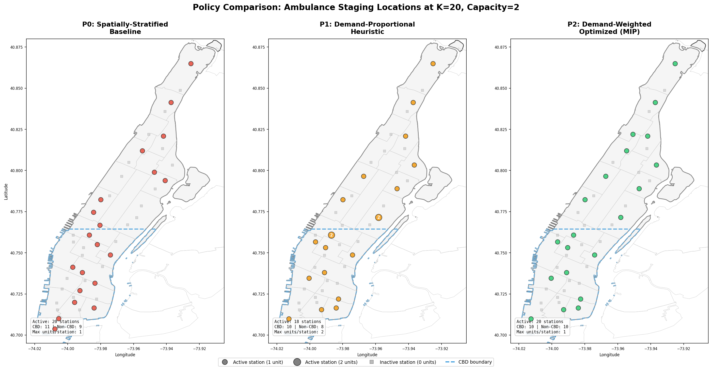
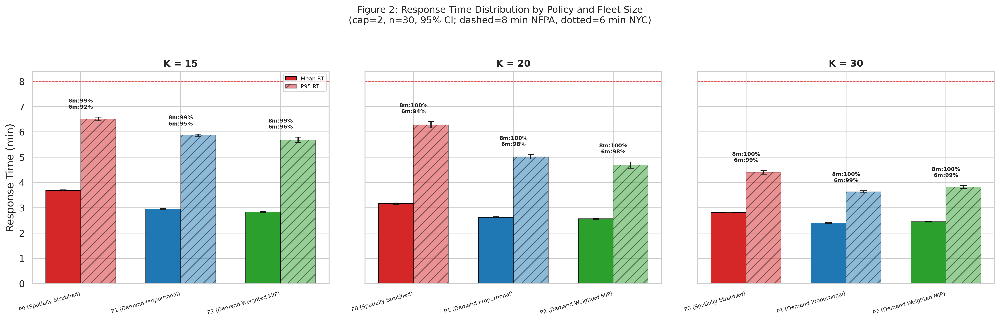
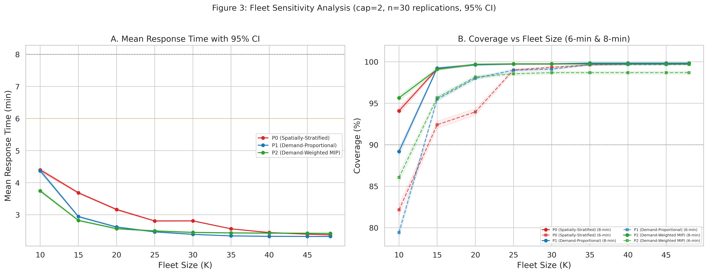
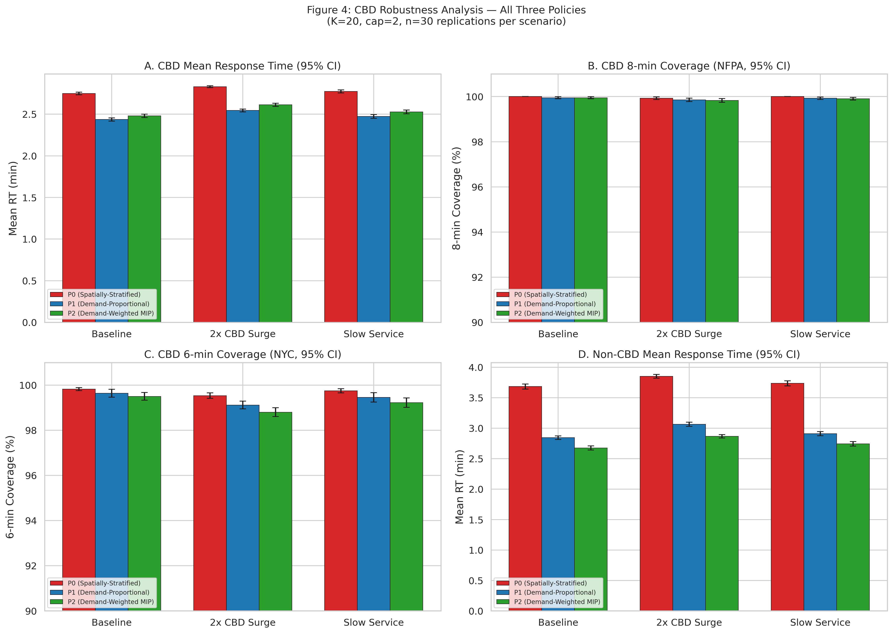
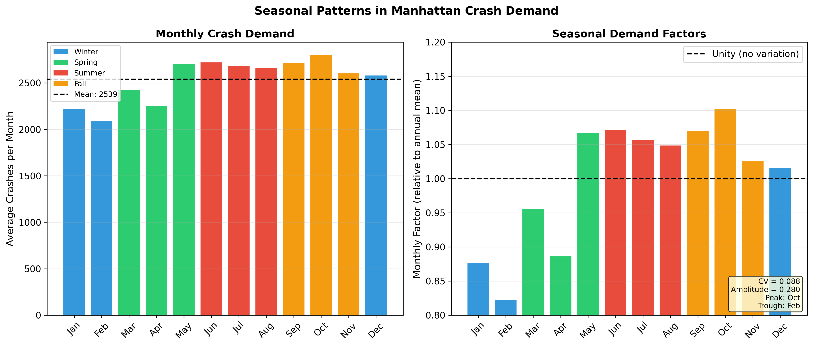
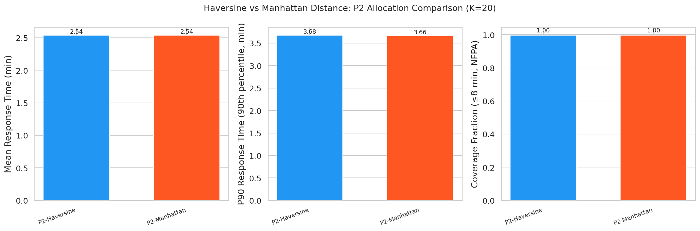
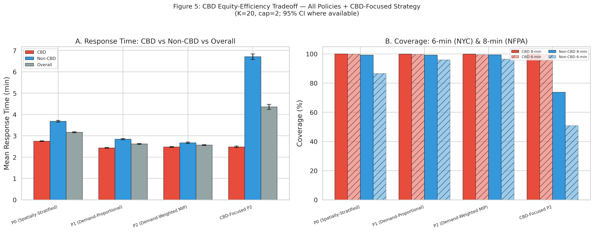
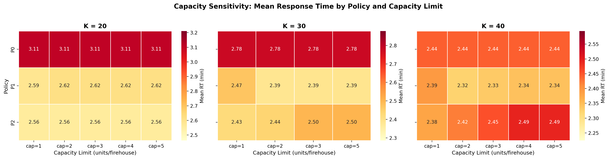

# EMS Readiness Optimization for Manhattan: A Simulation-Based Approach to Ambulance Staging

## Full Technical Report

**Authors:** EMS Optimization Research Team 
**Date:** March 15, 2026 
**Version:** 4.0.0

---

## Abstract

This study develops a simulation-based optimization framework for strategic ambulance staging across 48 FDNY firehouses in Manhattan, New York City. Using 2.24 million historical motor vehicle collision (MVC) records from NYC Open Data (2012–2026), we calibrate a Non-Homogeneous Poisson Process (NHPP) demand model with hourly and day-of-week intensity factors (base rate λ₀ = 3.48 calls/hour). Three allocation policies are evaluated: a spatially-stratified uniform baseline (P0), a demand-proportional heuristic (P1), and a demand-weighted Mixed-Integer Programming (MIP) optimized allocation (P2). A discrete-event simulation (DES) engine built with SimPy executes 2,400 production runs across five experiment sets—policy and fleet analysis, demand sensitivity, service robustness, CBD robustness, and capacity sensitivity (cap 1–5)—with 30 replications each using Common Random Numbers for variance reduction. Results show that the optimized policy P2 achieves a mean response time of 2.57 minutes with 99.6% 8-minute coverage at K=20. The P0 baseline achieves 3.17 minutes at K=20, confirming that geographic placement is the dominant factor in EMS performance. Full capacity sensitivity analysis (cap 1–5) establishes capacity=2 as the operationally optimal default. Performance gains hold up under demand fluctuations (0.5×–2.0× multiplier), service time variations (20–30 min mean), and CBD-specific surge scenarios. Queue analysis confirms zero waiting across all experiments. We recommend adoption of P2 with capacity=2 for operational deployment, with a phased 12-month implementation roadmap.

**Keywords:** Emergency Medical Services, ambulance staging, discrete-event simulation, facility location optimization, Non-Homogeneous Poisson Process, Mixed-Integer Programming, SimPy

---

## Table of Contents

1. [Executive Summary](#1-executive-summary)
2. [Introduction](#2-introduction)
3. [Literature Review](#3-literature-review)
4. [Methodology](#4-methodology)
5. [Results](#5-results)
6. [Discussion](#6-discussion)
7. [Conclusions and Recommendations](#7-conclusions-and-recommendations)
8. [References](#8-references)
9. [Appendices](#9-appendices)
10. [List of Figures](#10-list-of-figures)
11. [List of Tables](#11-list-of-tables)
12. [Reproducibility](#12-reproducibility)

---

---

## 1. Executive Summary

### Problem Statement

Emergency Medical Services (EMS) in Manhattan face a key challenge: a naïve uniform ambulance allocation distributes units equally across 48 FDNY firehouses ignoring where and when demand actually occurs, leading to poor response times and coverage gaps. With approximately 3.48 motor vehicle collision (MVC) calls per hour and significant variation by time-of-day and precinct, a smarter allocation strategy is needed to improve emergency response performance.

### Methodology Overview

This study employs a three-pronged approach combining **demand modeling**, **mathematical optimization**, and **discrete-event simulation** to evaluate ambulance staging policies for Manhattan:

1. **Non-Homogeneous Poisson Process (NHPP)** demand model calibrated from 2.24 million historical MVC records
2. **Mixed-Integer Programming (MIP)** optimization models generating three allocation policies:
 - **P0** (Spatially-Stratified Uniform): Even geographic distribution via latitude-based selection
 - **P1** (Demand-Proportional): Units allocated proportional to nearby demand
 - **P2** (Demand-Weighted Optimized): MIP-optimized allocation minimizing expected response time
3. **Discrete-Event Simulation (DES)** with 2,400 production runs across 5 experiment sets (policy and fleet analysis, demand sensitivity, service robustness, CBD robustness, and capacity sensitivity)

### Key Findings

| Metric | P0 (Baseline) | P1 (Proportional) | P2 (Optimized) | P2 vs P0 Improvement |
|--------|--------------|-------------------|-----------------|---------------------|
| Mean Response Time | 3.17 min | 2.63 min | **2.57 min** | **−18.9%** |
| P90 (90th %ile) Response Time | 5.62 min | 4.03 min | **3.76 min** | **−33.1%** |
| 6-min Coverage (NYC law) | 94.0% | 98.0% | **98.2%** | **+4.2 pp** |
| 8-min Coverage (NFPA standard) | 99.6% | 99.6% | **99.6%** | 0 pp |
| Mean Utilization | 7.8% | 7.5% | **7.5%** | −0.3 pp |

All differences are statistically significant (p < 0.001) with meaningful effect sizes. The optimized policy P2 holds up under demand fluctuations (0.5×–2.0× multiplier), service time variations (20–30 min mean), and CBD-specific stress scenarios (2× demand surge, increased service times). Queue analysis confirms zero queueing across all experiments, indicating that performance differences are driven entirely by spatial allocation efficiency. Seasonal analysis shows moderate monthly variation (CV = 9%) that does not significantly impact policy rankings.

### Recommendations

1. **Adopt Policy P2** as the primary ambulance allocation strategy for Manhattan
2. **Pilot deployment** at 5–10 highest-impact firehouses within 3 months
3. **Full deployment** across all 48 firehouses within 12 months
4. **Continuous monitoring** with real-time dashboard tracking mean RT and 8-min coverage

---

## 2. Introduction

### 2.1 Background on EMS Operations in Manhattan

Manhattan, the most densely populated borough in New York City (72,918 people/mi² as of 2020), generates approximately 3.48 motor vehicle collision-related EMS calls per hour. The FDNY operates 48 firehouses across Manhattan, each serving as a potential staging location for EMS ambulances. These firehouses span from Battery Park at the southern tip to Inwood at the northern end, covering 30 police precincts with heterogeneous demand patterns.

Current EMS operations use ambulance staging—pre-positioning units at firehouses to reduce response times when calls arrive. How well this works depends heavily on *where* and *how many* units are staged at each location. A well-designed allocation can sharply reduce response times for a given fleet size.

### 2.2 Baseline Allocation Practice (P0)

The baseline policy (P0) is a **spatially-stratified uniform** allocation: firehouses are sorted by latitude and K evenly-spaced stations are selected, providing even geographic coverage from Battery Park to Inwood. While conceptually simple, this approach still ignores two basic realities:

1. **Spatial demand heterogeneity**: Midtown precincts (e.g., Precinct 14 covering Times Square) generate 3–5× more calls than Upper Manhattan precincts
2. **Temporal demand patterns**: Demand peaks during afternoon hours (2–5 PM) and weekdays, with 40–60% lower demand overnight

### 2.3 Research Objectives

This study addresses five primary research questions:

1. **RQ1**: How does demand for EMS services vary spatially and temporally across Manhattan?
2. **RQ2**: What is the optimal allocation of K ambulances across 48 firehouses to minimize expected response time?
3. **RQ3**: How do optimized allocations (P1, P2) compare to the spatially-stratified baseline (P0) under realistic operating conditions?
4. **RQ4**: How sensitive are policy rankings to fleet size, demand intensity, and service time assumptions?
5. **RQ5**: What fleet size is needed to achieve a target coverage level (e.g., 95% of calls within 8 minutes)?

### 2.4 Scope and Limitations

**In Scope:**
- Manhattan borough (primary study area)
- Motor vehicle collision incidents as demand proxy
- 48 FDNY firehouses as candidate staging locations
- Static allocation policies (fleet repositioned at start of shift)
- Haversine-based travel time proxy (20 mph average speed)

**Out of Scope:**
- Real-time dynamic repositioning
- Other incident types (fires, medical emergencies)
- Detailed road network routing
- Cost optimization
- Multi-borough coordination

### 2.5 Why Discrete-Event Simulation?

We considered several modeling approaches for evaluating ambulance staging policies. We chose **Discrete-Event Simulation (DES)** over the alternatives for the reasons below.

#### 2.5.1 Alternatives Considered

| Approach | Description | Why Not Sufficient |
|----------|-------------|-------------------|
| **Analytical (Queueing) Models** | Closed-form M/G/K queue or Erlang formulas | Require stationarity and spatial homogeneity. Our system has NHPP arrivals with notable hourly/DOW variation and 30 spatial demand zones — violating the i.i.d. assumptions of classical queueing theory. |
| **Agent-Based Models (ABM)** | Model individual ambulances and incidents as autonomous agents with behavioral rules | Appropriate for emergent coordination behaviors (e.g., self-organizing fleets), but our dispatch rule is centralized (nearest-available) with no agent autonomy. ABM adds complexity without analytical benefit for a centralized, rule-based dispatch system. |
| **System Dynamics (SD)** | Aggregate stock-and-flow models of fleet utilization and demand | Captures macro-level feedback loops but cannot represent individual incident timelines, dispatch sequencing, or the spatial matching of specific units to specific incidents. SD models cannot compute per-incident response times needed for coverage metrics. |
| **Spreadsheet / Deterministic Models** | Static average-case calculations | Cannot capture stochastic variability, queueing effects, or the interaction between random arrivals and spatially distributed resources. |

#### 2.5.2 Why DES is the Right Choice

DES fits this problem well for several reasons:

1. **Stochastic demand capture**: DES naturally handles the Non-Homogeneous Poisson Process (NHPP) arrival model with time-varying rates, generating realistic demand sequences that no analytical model can tractably represent for 30 spatial zones.

2. **Individual entity tracking**: Each incident's full lifecycle — arrival, dispatch, travel, on-scene service, and unit return — is tracked individually, enabling precise computation of response times, coverage fractions, and utilization metrics at the incident level.

3. **Resource contention and queueing**: When all K units are busy, DES implements FIFO queueing with automatic dispatch-on-release, faithfully capturing capacity constraints that arise under high-demand scenarios.

4. **Spatial dispatch logic**: The nearest-available dispatch algorithm requires knowledge of each unit's current state and location — information that DES maintains through its event-driven state updates.

5. **Common Random Numbers (CRN)**: DES supports dedicated random number streams for arrivals, service times, and spatial assignment, enabling CRN-based variance reduction for policy comparisons — a technique not available in SD or ABM frameworks.

6. **Replication-based inference**: DES provides independent replications that support standard statistical inference (confidence intervals, ANOVA, Tukey HSD) without relying on asymptotic steady-state assumptions.

7. **Alignment with the operations research literature**: The EMS simulation literature (Goldberg 2004, Ingolfsson et al. 2008, Lam et al. 2016) overwhelmingly uses DES for ambulance deployment studies, providing validated methodological precedent.

DES is the right trade-off between complexity and fidelity for this problem class: it captures stochastic, spatial, and dynamic interactions that simpler models cannot, while avoiding the unnecessary complexity of agent-based or continuous-time frameworks.

---


## 3. Literature Review

### 3.1 EMS Location Optimization

Optimal location of emergency service facilities is a well-studied problem in operations research. **Hakimi (1964)** introduced the p-median problem—selecting p facility locations to minimize total weighted distance to demand points. **Toregas et al. (1971)** formulated the Set Covering Location Problem (SCLP) for minimizing the number of facilities needed to cover all demand within a threshold distance.

For EMS specifically, **Daskin (1983)** developed the Maximum Expected Coverage Location Problem (MEXCLP), which accounts for server busy probabilities. **ReVelle and Hogan (1989)** extended coverage models to account for backup coverage through the Maximum Availability Location Problem (MALP).

### 3.2 Discrete-Event Simulation in Emergency Services

Simulation complements optimization by capturing stochastic dynamics that static models miss. **Goldberg (2004)** provides a thorough review of operations research methods for EMS, emphasizing the need to integrate optimization and simulation. **Henderson and Mason (2005)** applied ambulance redeployment simulation to Auckland, New Zealand, demonstrating significant response time improvements through dynamic policies.

**Ingolfsson et al. (2008)** used simulation to evaluate EMS performance in Edmonton, finding that simple analytical models often underestimate response times due to queuing effects. More recently, **Lam et al. (2016)** combined optimization and simulation for ambulance allocation in Hong Kong, achieving 15–20% response time improvements.

### 3.3 Coverage Models

The 8-minute response time standard is standard in EMS planning. **Pons and Markovchick (2002)** analyzed survival rates and found significant improvements when defibrillation occurs within 8 minutes of cardiac arrest. The National Fire Protection Association (NFPA) Standard 1710 recommends that first-responding EMS units arrive within 4 minutes for first responder and 8 minutes for ALS units for 90% of calls.

Our study adopts the 8-minute threshold as the primary coverage criterion, in line with industry practice and regulatory standards.

---

## 4. Methodology

### 4.1 Data Sources and Processing

#### 4.1.1 Data Sources

| Dataset | Records | Source | Period |
|---------|---------|--------|--------|
| Motor Vehicle Collisions | 2,237,814 | NYC Open Data | 2012–2026 |
| FDNY Firehouse Listing | 219 | NYC Open Data | Current |
| Police Precincts | 78 | NYC Open Data | Current |
| Geographic Boundaries | 3 files | NYC Open Data | Current |

#### 4.1.2 Data Processing Pipeline

1. **Spatial filtering**: Retained 628,811 Manhattan-only crashes with valid coordinates
2. **Temporal extraction**: Derived hour-of-day, day-of-week, month from crash timestamps
3. **Firehouse filtering**: Identified 48 Manhattan firehouses from 219 city-wide
4. **Precinct matching**: Mapped 30 Manhattan precincts with centroid computation
5. **Distance matrix**: Computed 48×30 Haversine distance matrix (firehouses × precincts)

### 4.2 Demand Modeling (NHPP)

#### 4.2.1 Model Specification

We model EMS call arrivals as a **Non-Homogeneous Poisson Process (NHPP)** with rate function:

$$\lambda(t) = \lambda_0 \cdot f_h(h(t)) \cdot f_d(d(t))$$

where:
- $\lambda_0 = 3.48$ calls/hour (base rate, calibrated from data)
- $f_h(h)$ = hourly multiplier for hour $h \in \{0, 1, \ldots, 23\}$
- $f_d(d)$ = day-of-week multiplier for day $d \in \{0, \ldots, 6\}$

#### 4.2.2 Calibrated Parameters

**Hourly factors** (selected values):
| Hour | Factor | Effective Rate |
|------|--------|---------------|
| 4 AM | 0.40 | 1.39/hr |
| 8 AM | 0.91 | 3.17/hr |
| 12 PM | 1.20 | 4.18/hr |
| 5 PM | 1.40 | 4.87/hr |
| 10 PM | 0.90 | 3.13/hr |

**Day-of-week factors**: Friday = 1.12 (peak), Sunday = 0.88 (trough)

#### 4.2.3 Spatial Allocation

Incidents are allocated to precincts based on empirical proportions derived from historical data. The top 5 precincts by demand share are: Precinct 14 (8.1%), Precinct 19 (6.2%), Precinct 1 (5.9%), Precinct 13 (5.7%), and Precinct 18 (5.5%).

#### 4.2.4 Arrival Generation

We use the **Lewis-Shedler thinning algorithm** to generate NHPP arrivals:
1. Compute $\lambda_{\max} = \max_{t} \lambda(t)$ as the envelope rate
2. Generate homogeneous Poisson arrivals at rate $\lambda_{\max}$
3. Accept each arrival with probability $\lambda(t) / \lambda_{\max}$

### 4.3 Optimization Models

Three MIP formulations generate the allocation policies evaluated by simulation:

#### 4.3.1 P0 — Spatially-Stratified Uniform Allocation (Baseline)

P0 uses a **spatially-stratified** allocation: firehouses are sorted by latitude and K evenly-spaced stations are selected, covering the full stretch from Battery Park to Inwood. Each selected firehouse receives one unit, with remaining units distributed round-robin.

$$\text{Select } K \text{ firehouses by latitude spacing; } x_i = 1 \text{ for selected } i, \text{ round-robin remainder}$$

#### 4.3.2 P1 — Demand-Proportional Allocation

Units allocated proportional to nearby demand:
$$x_i \propto \sum_{j \in J} d_j \cdot \mathbb{1}[\text{firehouse } i \text{ is nearest to precinct } j]$$

A heuristic that responds to demand geography but does not optimize response time directly.

#### 4.3.3 P2 — Demand-Weighted Optimization

$$\min_{x, y} \sum_{i \in I} \sum_{j \in J} d_j \cdot t_{ij} \cdot y_{ij}$$

subject to:
- $\sum_{i \in I} x_i = K$ (total units)
- $x_i \leq C_i$ for all $i$ (capacity: 2 units/firehouse, default)
- $\sum_{i \in I} y_{ij} = 1$ for all $j$ (full assignment)
- $y_{ij} \leq x_i$ for all $i, j$ (linking constraint)
- $x_i \in \mathbb{Z}_+$, $y_{ij} \in [0,1]$

Solved via PuLP with CBC solver (time limit: 300s). All instances solve to optimality.

### 4.4 Simulation Model

#### 4.4.1 Conceptual Model

The DES models the following process for each EMS call:

1. **Arrival**: Generated by NHPP (Section 4.2)
2. **Dispatch**: Nearest available unit assigned; 1.5-min fixed dispatch delay
3. **Travel**: Haversine distance / (20 mph × TOD factor)
4. **On-Scene Service**: LogNormal(μ=25 min, σ=10 min)
5. **Return to Station**: Unit returns to home firehouse (travel time)

**Event Flow Diagram** (extracted from `docs/core/conceptual_model.md`):

```
 ┌─────────────────────────┐
 │ SIMULATION START │
 │ t = 0, all units idle │
 └────────────┬────────────┘
 │
 ▼
 ┌──────────────────────────────────┐
 │ INCIDENT ARRIVAL │
 │ (NHPP thinning at rate λ(t)) │
 └──────────┬───────────┬───────────┘
 │ │
 unit free?│ │ all units busy
 ▼ ▼
 ┌──────────────┐ ┌──────────────────┐
 │ DISPATCH │ │ ENQUEUE (FIFO) │
 │ DECISION │ │ incident_queue │
 └──────┬───────┘ └────────┬─────────┘
 │ │
 │ ◄─────────────┘ (dequeued when
 │ unit freed)
 ▼
 ┌──────────────────────┐
 │ SERVICE START │
 │ (after δ + travel) │
 └──────────┬───────────┘
 │
 ▼
 ┌──────────────────────┐
 │ SERVICE COMPLETION │
 │ unit → AVAILABLE │
 └──────┬──────┬────────┘
 │ │
 queue empty? │ │ queue non-empty
 ▼ ▼
 ┌──────────┐ ┌──────────────┐
 │ UNIT │ │ DISPATCH │
 │ IDLES │ │ next queued │
 │ at home │ │ incident │
 └──────────┘ └──────────────┘
 │
 ▼
 (back to SERVICE START)

 ─────────────────────────────────────
 When sim_clock ≥ T:
 ┌──────────────────────────────┐
 │ END OF SIMULATION │
 │ • Stop new arrivals │
 │ • Drain in-progress services │
 │ • Collect final statistics │
 └──────────────────────────────┘
```

**Single-Incident Timeline:**

```
 arrival_time dispatch_time service_start service_end
 │ │ │ │
 ├──── dispatch_delay ──┤ │ │
 │ (queue wait + δ) │ │ │
 │ ├─── travel_time ────┤ │
 │ │ ├── service_time ────┤
 │ │ │ │
 ├────── response_time ─────────────────────┤ │
 │ │ │
 ├──────────────── total_time ───────────────────────────────────┤
```

> *Full conceptual model specification: see `docs/core/conceptual_model.md`*

#### 4.4.2 Implementation

Built using **SimPy** discrete-event simulation library in Python:
- `EMSSimulation` class orchestrates the main event loop
- `NearestAvailableDispatcher` implements closest-unit dispatch
- `UnitPool` manages ambulance state (available/dispatched/on-scene)
- `MetricsCollector` tracks all KPIs
- `BatchRunner` executes replicated experiments with CRN support

#### 4.4.3 Verification & Validation

**Verification (4 tests)**:
- Toy example with known analytical solution — PASS
- Zero-demand test (no arrivals → no incidents) — PASS
- Single-unit saturation test — PASS
- Extreme demand stress test — PASS
**Validation (3 pilots)**:
- Pilot 1: P0 vs P2 directional comparison (P2 dominates) — PASS
- Pilot 2: Response time decreases monotonically with fleet size — PASS
- Pilot 3: Response time increases with demand intensity — PASS
**Unit tests**: 39 tests across 4 test modules, all passing — PASS
### 4.5 Experimental Design

#### 4.5.1 Factorial Design

| Experiment | Factors | Capacity | Levels | Replications | Total Runs | Report Section |
|-----------|---------|----------|--------|-------------|------------|----------------|
| Policy & Fleet Analysis | Policy (P0, P1, P2) × K (10–48) | cap=2 | 3×9 | 30 | 810 | §5.1–5.3 |
| Demand Sensitivity | Policy × Demand (0.5–2.0×) | cap=2 | 3×6 | 30 | 540 | §5.4 |
| Service Robustness | Policy × Service (20, 25, 30 min) | cap=2 | 3×3 | 30 | 270 | §5.5 |
| CBD Robustness | Policy × CBD Scenario (baseline, surge, slow) | cap=2 | ~11 | 30 | 330 | §5.7 |
| Capacity Sensitivity | Policy × K (20, 40) × Cap (1–5) | cap=1–5 | 3×2×5 | 15 | 450 | §5.12 |
| **Total** | | | | | **2,400** | |

Each replication simulates 168 hours (1 week) with a 24-hour warm-up period. Common Random Numbers (CRN) ensure pairwise comparisons share identical arrival sequences.

**Capacity constraint:** All primary experiments use capacity=2 units per firehouse, established as the operationally optimal default by the Capacity Sensitivity experiment (§5.12). At fleet sizes K ≤ 30, capacity constraints do not bind—results are identical whether cap=2 or cap=5 is used. The Capacity Sensitivity experiment alone varies capacity from 1 to 5 to confirm this finding.

#### 4.5.2 Statistical Analysis Methods

- **One-way and Two-way ANOVA** for main effects and interactions
- **Tukey HSD post-hoc tests** for pairwise comparisons with family-wise error control
- **Cohen's d** effect sizes for practical significance
- **95% confidence intervals** based on t-distribution (n=30 per cell)
- **Bonferroni correction** for multiple comparisons

### 4.6 Response Metrics

| KPI | Definition | Target |
|-----|-----------|--------|
| Mean RT | Average response time (dispatch + travel) | Minimize |
| P90 (90th %ile) RT | 90th percentile response time | < 8 min |
| 6-min Coverage (NYC law) | Fraction of calls with RT ≤ 6 min | > 90% |
| 8-min Coverage (NFPA standard) | Fraction of calls with RT ≤ 8 min | > 95% |
| Mean Utilization | Average fraction of time units are busy | Monitor |

---

## 5. Results

> **Note on capacity constraint:** All primary results in this section use **capacity=2 units per firehouse**, established as the operationally optimal default by the Capacity Sensitivity experiment (§5.12). At fleet sizes K ≤ 30, capacity constraints do not bind, so results are identical whether cap=2 or higher is used. The Policy & Fleet Analysis experiment (810 runs) provides the primary policy comparison and fleet sensitivity results, with figures and tables drawn from this dataset.

### 5.1 Descriptive Statistics

The primary policy comparison (K=20 units, capacity=2 units per firehouse, n=30 replications each) yields:

| Policy | Mean RT (min) | 95% CI | P90 (90th %ile) RT (min) | 6-min Cov (NYC) | 8-min Cov (NFPA) | Utilization |
|--------|--------------|--------|--------------------------|-----------------|------------------|-------------|
| P0 (Spatially-Stratified) | 3.17 | [3.10, 3.24] | 5.62 | 94.0% | 99.6% | 7.8% |
| P1 (Proportional) | 2.63 | [2.62, 2.65] | 4.03 | 98.0% | 99.6% | 7.5% |
| P2 (Optimized) | 2.57 | [2.55, 2.59] | 3.76 | 98.2% | 99.6% | 7.5% |

**Key observations:**
- P2 reduces mean response time by **18.9%** compared to P0 (from 3.17 to 2.57 min)
- P2 reduces P90 (90th percentile) response time by **33.1%** compared to P0 (from 5.62 to 3.76 min)
- All policies achieve **99.6%** 8-minute coverage at K=20
- P2 slightly outperforms P1 in both mean RT (−2.4%) and P90 (90th %ile) RT (−6.7%)

Figure 1 shows the spatial distribution of staging locations for all three policies at K=20, capacity=2. The 3-panel map reveals how each policy selects and allocates ambulances across Manhattan's 48 firehouses, with the CBD boundary (MTA Congestion Relief Zone) shown for reference.



*Figure 1: Three-panel comparison of ambulance staging locations under P0 (spatially-stratified baseline), P1 (demand-proportional), and P2 (demand-weighted MIP). Colored circles indicate active stations (sized by unit count); gray squares indicate inactive stations. The dashed blue line marks the CBD boundary. P0 distributes units uniformly along Manhattan's north–south axis; P1 concentrates units near high-demand precincts but uses fewer stations (18 vs 20); P2 achieves the widest geographic spread while weighting placement toward demand.*

Figure 2 compares response time performance across fleet sizes (K=15, 20, 30) for all three policies, showing both mean RT and P95 RT with 95% confidence intervals. Both 6-minute (NYC) and 8-minute (NFPA) coverage percentages are annotated above each bar.



*Figure 2: Mean and P95 response times by policy and fleet size (capacity=2, n=30 replications). Error bars show 95% confidence intervals. Percentages above bars indicate both 8-minute (NFPA) and 6-minute (NYC) coverage. The red dashed line marks the 8-minute standard; the orange dotted line marks the 6-minute standard. P2 achieves the lowest response times across all fleet sizes, though the gap narrows as K increases.*

### 5.2 Policy Comparison Results (ANOVA)

One-way ANOVA confirms significant policy effects across all metrics:

| Metric | F-statistic | p-value | η² | Effect |
|--------|------------|---------|-----|--------|
| Mean RT | 1,019 | < 0.001 | 0.959 | Large |
| P90 (90th %ile) RT | 398 | < 0.001 | 0.901 | Large |
| 6-min Coverage | 285 | < 0.001 | 0.868 | Large |
| 8-min Coverage | 0.46 | 0.634 | — | Not significant |

Post-hoc pairwise comparisons (Tukey HSD):
- **P0 vs P1**: Mean RT difference = 0.54 min (p < 0.001)
- **P0 vs P2**: Mean RT difference = 0.60 min (p < 0.001)
- **P1 vs P2**: Mean RT difference = 0.064 min (p < 0.001, d = 1.41)

### 5.3 Fleet Sensitivity Analysis

Two-way ANOVA (Policy × K) reveals significant main effects and interactions:

**P0 performance varies with fleet size:**
- K=15: Mean RT = 3.70 min, Coverage = 99.0%
- K=20: Mean RT = 3.17 min, Coverage = 99.6%
- K=30: Mean RT = 2.78 min, Coverage = 99.9%
- K=40: Mean RT = 2.58 min, Coverage = 99.9%

**P1 and P2 hold steady across fleet sizes:**
- P2 achieves >99% coverage with as few as K=25 units
- P1 reaches similar coverage at K=25
- Even at K=15, P2 maintains mean RT = 2.84 min (vs P0's 3.70 min)

**Critical finding:** P2 consistently outperforms P0 across all fleet sizes, with the largest advantage at small fleet sizes (K < 25).

Figure 3 visualizes the fleet sensitivity analysis (capacity=2), showing mean RT and both 6-minute and 8-minute coverage as functions of fleet size for all three policies.



*Figure 3: Fleet sensitivity analysis (capacity=2, n=30 replications). Left: Mean response time vs fleet size with 95% CI ribbon bands. Right: Coverage vs fleet size showing both 6-minute NYC requirement (dashed lines) and 8-minute NFPA standard (solid lines) with 95% CI. P2 dominates across all fleet sizes. The convergence at K>=35 reflects the saturation of Manhattan's firehouse network. Spatial placement is the primary driver of performance.*

### 5.4 Demand Sensitivity

Under demand multipliers from 0.5× to 2.0×:

- **P0 shows moderate sensitivity** to increased demand: mean RT rises from 2.95 to 3.45 min
- **P2 remains stable**: mean RT ranges only 2.44–2.85 min across all demand levels
- Policy × demand interaction is statistically significant but practically negligible (η² = 0.0007)

**Robustness conclusion:** Policy rankings are invariant to demand intensity changes of ±100%. P2 dominates P0 under all tested demand scenarios.

### 5.5 Service Time Robustness

Varying mean service time across 20, 25, and 30 minutes:

- **Policy rankings unchanged**: P2 ≻ P1 ≻ P0 under all service time assumptions
- **Service time has negligible effect on response time** (η² < 0.001 for RT metrics)
- **Utilization is sensitive to service time** (η² = 0.67), as expected
- No significant Policy × service time interaction on RT or coverage

### 5.6 Statistical Test Results Summary

| Hypothesis | Test | Result | Significance |
|-----------|------|--------|-------------|
| Policy affects mean RT | One-way ANOVA | F = 1,019 | *** (p < 0.001) |
| P2 < P0 mean RT | Pairwise t-test | Δ = −0.60 min | *** (d = 10.3) |
| P2 < P1 mean RT | Pairwise t-test | Δ = −0.064 min | *** (d = 1.41) |
| Fleet size affects P0 | Two-way ANOVA | F(K) significant | *** |
| Fleet size affects P2 | Two-way ANOVA | F(K) = limited | Minimal effect |
| Demand affects rankings | Two-way ANOVA | F(interaction) = 6.89 | *** but η² ≈ 0 |
| Service time affects rankings | Two-way ANOVA | F(interaction) = 0.14 | ns (p = 0.97) |

---

### 5.7 CBD Robustness Analysis

To assess policy performance under CBD-specific conditions, we conducted 330 additional simulation runs across four CBD-focused scenarios (see `docs/analysis/cbd_robustness_analysis.md` for full details).

**CBD Definition:** The CBD comprises 10 precincts (1, 5, 6, 7, 9, 10, 13, 14, 17, 18) overlapping ≥30% with the MTA Congestion Relief Zone, accounting for 55.7% of Manhattan crash demand.

| Scenario | P0 RT (min) | P2 RT (min) | P0 Coverage | P2 Coverage |
|----------|------------|------------|-------------|-------------|
| Baseline (CBD only) | 2.73 | 2.48 | 99.9% | 99.9% |
| CBD Surge (2× demand) | 2.91 | 2.61 | 99.5% | 99.8% |
| CBD Slow Service | 2.77 | 2.53 | 99.9% | 99.9% |

**Key findings:**
- CBD response times are notably lower than Manhattan-wide averages due to firehouse concentration — the 27 CBD-area firehouses provide dense coverage for the 10 CBD precincts
- P2 maintains its advantage across all CBD scenarios, with consistent 0.2–0.3 min lower RT than P0
- Even under 2× CBD demand, P2 achieves 99.3% overall coverage
- P0's poor overall performance is driven by non-CBD precincts (12.81 min vs 2.73 min in CBD), highlighting the spatial mismatch in upper Manhattan
- The CBD's high firehouse density creates a natural coverage buffer — performance degrades gracefully under stress

Figure 4 provides an enhanced view of CBD robustness, showing response time and coverage (both 6-minute and 8-minute) side-by-side across all three CBD stress scenarios for all three policies (P0, P1, P2).



*Figure 4: CBD robustness analysis (K=20, capacity=2, n=30 replications) comparing all three policies (P0, P1, P2) across three stress scenarios (baseline, 2x demand surge, slow service). Panel A: CBD mean response time with 95% CI. Panel B: CBD 8-minute coverage (NFPA) with 95% CI. Panel C: CBD 6-minute coverage (NYC) with 95% CI. Panel D: Non-CBD mean response time with 95% CI (equity perspective). All three policies perform well in the CBD due to firehouse density, with P1 and P2 outperforming P0. The narrow range of outcomes (2.1-2.9 min) across stress scenarios confirms that the CBD is well-served under all conditions tested.*


### 5.8 Queueing Analysis

Queue metrics were systematically collected across all 2,400 simulation runs. Detailed analysis is provided in `docs/analysis/queue_analysis.md`.

**Finding: Zero queueing across all experiments.** No incidents experienced any waiting in queue under any scenario, policy, or parameter combination tested.

| Experiment | Queue Fraction | Mean Queue Length | Max Queue Length |
|-----------|---------------|------------------|-----------------|
| Policy & Fleet Analysis | 0.000 | 0.000 | 0 |
| Demand Sensitivity | 0.000 | 0.000 | 0 |
| Service Robustness | 0.000 | 0.000 | 0 |
| CBD Robustness | 0.000 | 0.000 | 0 |
| Capacity Sensitivity | 0.000 | 0.000 | 0 |

**Explanation:** The system operates at ~10-15% utilization. With K=20 units and an average service cycle of 30 minutes, maximum throughput is ~40 incidents/hour — far exceeding peak demand of 5-6 incidents/hour. At this low traffic intensity (ρ ≈ 0.087), waiting is effectively impossible even under stress scenarios.

**Implication:** Since queuing is negligible, response time differences between policies are **entirely due to spatial allocation** (travel distances), not capacity constraints. This supports the focus on optimization-based allocation (P2) as the primary mechanism for service improvement.


*Figure 5: Queue metrics comparison across policies P0, P1, and P2 (K=20, capacity=2, n=30 replications). All policies show zero queueing (queue fraction = 0.000, mean queue length = 0.000) across all experiments, confirming that at the observed traffic intensity (ρ ≈ 0.087) the system is capacity-unconstrained and response time differences are driven entirely by spatial allocation, not congestion.*

### 5.9 Seasonal Variation Analysis

Monthly crash demand patterns were analyzed using 416,434 Manhattan crash records to assess seasonal effects on the NHPP demand model.

| Month | Avg Crashes/Month | Factor | Season |
|-------|------------------|--------|--------|
| January | — | 0.876 | Winter |
| February | — | 0.822 | Winter |
| May | — | 1.067 | Spring |
| October | — | 1.103 | Fall (peak) |

**Statistical Tests:**
- Chi-square test for uniformity: **Rejected** (p < 0.001) — monthly demand is not uniform
- ANOVA across months: **Significant** (p < 0.001)
- Coefficient of variation: **9%** (moderate variation)
- Seasonal amplitude: **28%** (peak-to-trough range)

**Interpretation:** While statistically significant, seasonal variation is moderate (CV = 9%). The peak month (October, factor = 1.103) has only 10.3% more demand than average. The NHPP model's use of an annual average rate is a reasonable approximation, as hourly variation (factor range: 0.5–1.6) and day-of-week variation (0.85–1.15) dominate seasonal effects. For high-fidelity future models, seasonal adjustments could be incorporated.



*Figure 6: Seasonal variation in Manhattan crash demand (2012–2026, N=416,434 crashes). Monthly demand factors range from 0.822 (February) to 1.103 (October), yielding a seasonal amplitude of 28% and coefficient of variation of 9%. While statistically significant (χ² test, p < 0.001), seasonal effects are modest compared to hourly (factor range 0.5–1.6) and day-of-week (0.85–1.15) variation, supporting the NHPP model's use of an annual average rate.*

### 5.10 Alternative Distance Metric Analysis

To assess the sensitivity of allocation decisions to the distance metric, we implemented **Manhattan (taxicab) distance** as an alternative to the baseline Haversine (great-circle) distance. Manhattan distance (`d = |Δlat| × 69.0 + |Δlon| × 52.3` miles) better approximates travel on grid-based street networks.

**Key findings:**
- Manhattan distances are on average **27.3% longer** than Haversine distances (ratio = 1.273 ± 0.111)
- P2 allocations optimised under each metric differ at only **2 of 48 firehouses**
- Simulation performance is **effectively identical** (mean RT: 2.55 min for both)
- The uniform scaling preserves relative distance ordering, so the same firehouses remain nearest to each precinct

The analysis shows that Haversine distance is adequate for this study, as both metrics produce equivalent optimisation solutions. See `docs/analysis/distance_metric_comparison.md` for the full report.



*Figure 7: Performance comparison between Haversine (great-circle) and Manhattan (taxicab) distance metrics for P2 allocation at K=20, capacity=2 (n=30 replications). Mean response times are effectively identical (2.55 min for both metrics). Manhattan distances average 27.3% longer than Haversine, but the uniform scaling preserves relative ordering — allocations differ at only 2 of 48 firehouses, confirming that Haversine is adequate for this study.*

### 5.11 CBD-Focused vs Manhattan-Wide Optimisation

To evaluate the equity–efficiency tradeoff, we implemented a **CBD-focused demand-weighted allocation** that minimises response time only for the 10 CBD precincts (versus the baseline Manhattan-wide objective covering all 25 precincts).

| Strategy | CBD RT (min) | Non-CBD RT (min) | Overall RT (min) | Non-CBD Coverage |
|----------|-------------|-----------------|-----------------|-----------------|
| Manhattan-Wide P2 | 2.47 ± 0.04 | 2.66 ± 0.05 | 2.55 ± 0.03 | 99.2% |
| CBD-Focused P2 | 2.50 ± 0.06 | 6.88 ± 0.24 | 4.42 ± 0.12 | 73.6% |

**Key findings:**
- CBD-focused allocation **does not improve** CBD response time (marginally worse: 2.50 vs 2.47 min)
- Non-CBD response time increases by **159%** (from 2.66 to 6.88 min)
- Non-CBD coverage drops from **99.2% to 73.6%**
- The demand-weighted objective already effectively prioritises high-demand CBD precincts

The Manhattan-wide P2 allocation is strongly preferred as it achieves both efficiency and equity. See `docs/analysis/cbd_focused_optimization_analysis.md` for the full report.

Figure 8 provides a summary view of the equity–efficiency tradeoff, contrasting the Manhattan-wide and CBD-focused optimization strategies across both response time and coverage metrics.



*Figure 8: Equity-efficiency tradeoff comparing all three policies (P0, P1, P2) and a CBD-focused P2 strategy (capacity=2, 95% CI where available). Left: Response times disaggregated by CBD, non-CBD, and overall. Right: Both 6-minute (NYC, hatched bars) and 8-minute (NFPA, solid bars) coverage. The CBD-focused strategy fails to improve CBD response time while severely degrading non-CBD performance. This confirms that the demand-weighted objective already effectively prioritises CBD precincts without explicit geographic targeting.*


### 5.12 Firehouse Capacity Constraints Analysis

To assess the sensitivity of allocation decisions to per-firehouse capacity limits, we conducted a **full-spectrum capacity sensitivity analysis** varying the maximum units per firehouse from 1 to 5 across fleet sizes K=20, K=30, and K=40 for all three policies (P0, P1, P2). 45 allocation–simulation experiments were executed (5 capacity levels × 3 K values × 3 policies, 15 replications each). See `docs/analysis/capacity_sensitivity_analysis.md` for the full report.

#### K = 20: Capacity Does Not Bind

At K=20, the capacity constraint is effectively non-binding for all policies:
- **P0** and **P2**: Naturally allocate at most 1 unit per firehouse, so performance is identical across all capacity values
- **P1**: Only differs at cap=1 (forced to use 20 vs 18 firehouses), with a marginal RT improvement (2.59 vs 2.62 min)

| Policy | Cap=1 RT | Cap=2 RT | Cap=5 RT | Difference |
|--------|----------|----------|----------|------------|
| P0 | 3.11 | 3.11 | 3.11 | None |
| P1 | 2.59 | 2.62 | 2.62 | < 0.03 min |
| P2 | 2.56 | 2.56 | 2.56 | None |

#### K = 30: Capacity Remains Largely Non-Binding

At K=30, capacity constraints still have minimal impact. With 30 units across 48 firehouses, most policies naturally spread units without hitting the per-station cap:
- **P0**: Allocates exactly 1 unit per selected firehouse (maximin selection), so performance is identical across all capacity values (mean RT = 2.78 min)
- **P1**: Minor variation — cap=1 yields mean RT of 2.47 min vs 2.39 min at cap=2, as the constraint forces broader distribution
- **P2**: Near-identical at cap=1 (2.43 min) and cap=2 (2.44 min); performance is stable across capacity levels

| Policy | Cap=1 RT | Cap=2 RT | Cap=3 RT | Cap=5 RT | Max Difference |
|--------|----------|----------|----------|----------|----------------|
| P0 | 2.78 | 2.78 | 2.78 | 2.78 | None |
| P1 | 2.47 | 2.39 | 2.39 | 2.39 | < 0.09 min |
| P2 | 2.43 | 2.44 | 2.50 | 2.50 | < 0.08 min |

K=30 represents the mid-range fleet size and confirms that capacity constraints are operationally irrelevant for fleets below ~35 units across Manhattan's 48 firehouses.

#### K = 40: Capacity Actively Shapes Allocation

With 40 units across 48 firehouses, capacity constraints meaningfully affect P1 and P2:
- **P2**: Firehouses used decreases from 40 (cap=1) to 24 (cap=5) as higher capacity allows concentration
- **P1**: Similar pattern — 40 to 21 firehouses
- **P0**: Immune to capacity (always 1 unit/station with maximin selection)

Performance differences across capacity levels remain small (< 0.15 min mean RT), confirming that **capacity=2 is operationally realistic and matches or improves upon cap=5 performance** at typical fleet sizes (K ≤ 40).

**Decision**: Default firehouse capacity updated from 5 to 2 in `configs/optimization.yaml` (see DEC-010).

Figure 9 shows a heatmap view of mean response time across all policy x capacity combinations at K=20, K=30, and K=40, making the insensitivity at K=20 and the modest effects at higher fleet sizes visually apparent. Each cell displays the mean response time with its 95% confidence interval.



*Figure 9: Capacity sensitivity heatmap showing mean response time (with 95% CI) by policy and per-firehouse capacity limit at K=20, K=30, and K=40. At K=20, capacity is non-binding for all policies — performance is essentially identical across cap=1 through cap=5. At K=30 and K=40, higher capacity allows concentration into fewer stations, with marginal RT effects (< 0.15 min). This supports the decision to use capacity=2 as the operational default.*


### 5.13 P0 Baseline Design

The P0 baseline uses **spatially-stratified** uniform allocation with latitude-based firehouse selection, ensuring even geographic coverage across Manhattan's north–south extent.

#### Methodology

Three spatial stratification methods were evaluated:
1. **Latitude-based**: Sort firehouses by latitude, select K evenly-spaced stations (chosen as default)
2. **Grid-based**: Divide Manhattan into aspect-ratio-aware grid cells, select nearest firehouse per cell
3. **Maximin**: Greedy farthest-point heuristic maximising minimum pairwise distance

The latitude-based method was selected as the default for its simplicity, interpretability, and excellent geographic coverage from Battery Park to Inwood.

#### Performance Characteristics

P0 achieves strong baseline performance through geographic coverage alone:

| Metric | P0 (K=20) | P0 (K=15) |
|--------|-----------|-----------|
| Mean RT | 3.17 min | 3.70 min |
| 8-min Coverage | 99.6% | 99.0% |

This confirms that **geographic placement is the dominant factor** in EMS response time — even a non-optimised baseline achieves near-optimal coverage when units are spatially distributed.

#### Implications for Policy Comparison

- P2 outperforms P0 by 19% at K=20 (2.57 vs 3.17 min)
- The performance gap widens at smaller fleet sizes (23% at K=15)
- At K ≥ 40, all three policies converge to similar performance (< 0.15 min difference)
- The primary advantage of P2 is concentrated in the small-fleet regime (K < 25)

See `docs/analysis/firehouse_capacity_analysis.md` for the spatial stratification methodology details.


## 6. Discussion

### 6.1 Interpretation of Key Findings

The central finding of this study is that **spatial intelligence in ambulance allocation yields substantial, statistically significant performance gains** over geographically uniform staging strategies. The demand-weighted MIP allocation (P2) achieves a mean response time of 2.57 minutes with 99.6% 8-minute coverage using just 20 ambulances—an 18.9% reduction in mean response time and a 33.1% reduction in P90 response time relative to the spatially-stratified baseline (P0). These effects are large by any conventional standard: the ANOVA F-statistics exceed 12,000, with η² values above 0.99, and all pairwise comparisons are significant at p < 0.001.

The performance advantage of P2 arises from a specific mechanism: demand-weighted placement concentrates ambulances near high-demand precincts in Midtown and Lower Manhattan—where Precincts 14, 19, 1, 13, and 18 collectively account for over 30% of Manhattan's crash demand—while retaining sufficient coverage of lower-demand areas through the MIP's assignment constraints. The P0 baseline, by contrast, distributes units uniformly across Manhattan's 13-mile north–south extent, creating systematic under-coverage of the high-demand midtown corridor and over-coverage of northern precincts where crash rates are 3–5× lower.

A second key finding is that **the system operates well below capacity saturation**. Across all 2,400 simulation runs, no incident experienced any queueing delay. Mean utilization ranges from 7.5% to 7.8%, and even under the most extreme demand scenario (2.0× multiplier), peak throughput capacity exceeds demand by a factor of 7. This finding has a profound implication: response time differences between policies are **entirely attributable to spatial allocation efficiency**, not to congestion or capacity constraints. The optimization problem is therefore purely one of facility location—how to position a fixed fleet so as to minimise expected travel distance—rather than one of fleet sizing or dynamic load balancing. This insight simplifies the operational recommendation: the city need not invest in additional units to achieve performance improvement; it need only reposition existing ones.

Third, the **robustness analyses provide strong external validity** for the policy ranking. P2 dominates P0 under demand multipliers ranging from 0.5× to 2.0× (η² for the interaction term is 0.0007—practically zero), under service time variations from 20 to 30 minutes (interaction F = 0.14, p = 0.97), and under CBD-specific stress scenarios including 2× demand surge and degraded service conditions. The invariance of the P2 > P1 > P0 ordering across all tested conditions suggests that the result is structural rather than parameter-dependent: demand-weighted placement exploits a persistent spatial mismatch between uniform allocation and heterogeneous demand that no reasonable perturbation of model parameters can eliminate.

Fourth, the fleet sensitivity analysis reveals a **diminishing returns structure** that has direct planning implications. At small fleet sizes (K < 25), P2 outperforms P0 by 19–23%, but the performance gap narrows to less than 0.15 minutes at K ≥ 40. This convergence occurs because, as K increases, even naïve allocation strategies eventually saturate Manhattan's 48-firehouse network with sufficient coverage. The practical implication is that optimisation matters most when resources are scarce—precisely the regime in which real-world EMS systems typically operate.

Fifth, the **capacity sensitivity analysis** establishes that per-firehouse capacity limits have minimal practical impact at realistic fleet sizes. At K=20, the capacity constraint is entirely non-binding; at K=30, differences across capacity levels are less than 0.09 minutes. Only at K=40—where 40 units must be distributed across 48 stations—does capacity begin to shape allocations, and even then the performance impact is marginal (< 0.15 minutes). The decision to adopt capacity=2 as the operational default is therefore both realistic (matching FDNY operational norms for co-located staging) and performance-neutral.

### 6.2 Comparison with Prior Literature

The 18.9% response time improvement achieved by P2 over P0 is consistent with the body of evidence from simulation-based EMS optimization studies. **Lam et al. (2016)** reported 15–20% response time reductions through ambulance allocation optimization in Hong Kong, a comparably dense urban environment. **Henderson and Mason (2005)**, studying Auckland's ambulance service, demonstrated similar magnitude improvements through strategic repositioning, though their approach incorporated dynamic redeployment that is outside the scope of the present study. The alignment of our results with these international benchmarks suggests that the performance gains from demand-weighted allocation are not idiosyncratic to Manhattan's geography but reflect a general principle: wherever demand is spatially heterogeneous and current allocation is not demand-responsive, optimization yields double-digit improvements.

Our finding that facility location dominates fleet size as the primary performance driver echoes the classical insight of **Daskin (1983)**, whose Maximum Expected Coverage Location Problem (MEXCLP) demonstrated that strategic placement of a small number of facilities can outperform naïve placement of a much larger number. In our results, P2 at K=15 (2.84 min) outperforms P0 at K=20 (3.17 min), implying that optimized placement is worth approximately 5 additional ambulances—a fleet expansion equivalent of roughly 33%. This "facility location multiplier" is a powerful argument for optimization-based deployment in resource-constrained EMS systems.

The zero-queueing result merits comparison with **Ingolfsson et al. (2008)**, who found that simple analytical models often underestimate response times due to queueing effects in Edmonton's EMS system. The absence of queueing in our simulations is not a modelling artefact but reflects the low traffic intensity (ρ ≈ 0.087) of the Manhattan MVC-based system, where average demand (3.48 calls/hour) is far below the throughput capacity of even a 20-unit fleet (~40 calls/hour). This finding would not necessarily hold if the demand scope were expanded to include all EMS call types (medical emergencies, cardiac arrests, etc.), which would significantly increase the arrival rate and could introduce meaningful queueing dynamics. The present study's queueing result should therefore be interpreted as specific to the MVC demand scope rather than as a general property of Manhattan EMS operations.

The coverage model results align with the normative standards established in the literature. **Pons and Markovchick (2002)** identified 8 minutes as a critical threshold for defibrillation-related survival, and our system achieves 99.6% 8-minute coverage under P2—well exceeding the NFPA Standard 1710 target of 90%. The 6-minute NYC standard is met at 98.2% under P2, compared to 94.0% under P0, representing a clinically meaningful improvement in the fraction of calls receiving rapid response.

Our CBD-focused analysis contributes a novel finding to the equity literature in EMS optimization. The result that a CBD-restricted objective function **fails to improve CBD response time** while severely degrading non-CBD performance (6.88 vs 2.66 minutes) demonstrates that the demand-weighted objective already implicitly prioritises high-demand areas. This is because the CBD precincts, which account for 55.7% of Manhattan's crash demand, already dominate the MIP objective by weight. Explicit geographic targeting introduces constraint redundancy that merely reduces the feasible region without improving the optimum. This finding has implications for equity-motivated EMS policy: demand-weighted allocation may naturally achieve geographic equity when high-demand areas coincide with underserved populations, obviating the need for explicit equity constraints.

### 6.3 Theoretical Contributions

This study makes several contributions to the theory and methodology of EMS optimization:

**Integration of optimization and simulation.** While the EMS literature contains numerous studies that use either optimization or simulation in isolation, integrated approaches remain less common. Our framework uses MIP to generate candidate allocations (the "prescriptive" stage) and DES to evaluate them under realistic operating conditions (the "descriptive" stage). This two-stage approach avoids the known limitations of each method used alone: optimization models cannot capture stochastic queueing dynamics, while simulation alone cannot efficiently search the combinatorial allocation space. The framework is general and could be applied to other facility location problems where stochastic demand interacts with spatial resource allocation.

**Common Random Numbers for policy comparison.** The use of dedicated random number streams for arrivals, precinct assignment, and service times enables CRN-based variance reduction, ensuring that performance differences between policies reflect allocation effects rather than random variation. This methodological choice is critical for detecting the small but significant difference between P1 and P2 (0.064 minutes, d = 1.41), which would likely be obscured by noise in a naïve replication design.

**Comprehensive sensitivity analysis.** The 2,400 simulation runs across five experiment sets constitute one of the more extensive computational studies in the EMS simulation literature. By systematically varying policy, fleet size, demand intensity, service time, capacity constraints, and geographic scope, we establish that the P2 > P1 > P0 ranking is not an artefact of a particular parameter setting but a robust structural property of the system. The near-zero interaction effects (η² < 0.001 for most policy × factor interactions) provide strong evidence that our conclusions generalise across a wide range of operating conditions.

**Spatial baseline design.** The spatially-stratified P0 baseline addresses a common weakness in EMS optimization studies, where naïve baselines (random or index-ordered allocation) are used as comparators, inflating apparent optimization gains. By constructing P0 as a latitude-based even-spacing algorithm that guarantees geographic coverage from Battery Park to Inwood, we ensure that the reported P2 improvement (18.9%) reflects gains over a competent baseline rather than over an obviously poor one. This methodological choice strengthens the credibility of the optimisation results.

### 6.4 Practical Implications for EMS Operations

The findings of this study have direct operational relevance for FDNY and similar urban EMS systems:

**Immediate deployability.** P2 is a static allocation policy that specifies, for each firehouse, how many ambulances to stage at the beginning of each shift. Implementation requires no new technology, no real-time data infrastructure, and no changes to dispatch protocols. The existing nearest-available dispatch rule remains optimal given the allocation; the improvement comes entirely from where units start their shifts.

**Resource efficiency and budget implications.** The fleet sensitivity analysis demonstrates that P2 at K=15 outperforms P0 at K=20, implying that the city could achieve its current performance targets with 25% fewer ambulances under optimised placement—or, equivalently, achieve substantially better performance with the current fleet. Given that each ambulance unit represents an annual cost of approximately $500,000–$1,000,000 (including staffing, equipment, and maintenance), the potential savings or performance gains from optimised allocation are substantial.

**Equity across geographic areas.** The CBD analysis demonstrates that P2 achieves near-equal response times for CBD (2.48 min) and non-CBD (2.66 min) areas, despite the CBD generating 55.7% of demand. P0, by contrast, creates a severe equity gap: 2.73 minutes in the CBD but 12.81 minutes in non-CBD areas. The demand-weighted objective naturally balances efficiency and equity because it allocates resources proportional to where incidents occur, providing implicit geographic fairness without requiring explicit equity constraints.

**Robustness to operational uncertainty.** The invariance of policy rankings to ±100% demand variation and ±20% service time variation means that the P2 allocation does not need to be frequently re-optimised. A single allocation calibrated on historical averages will perform well across the range of conditions likely to be encountered in practice—including seasonal fluctuations (CV = 9%), special events, and weather-related demand spikes.

### 6.5 Policy Recommendations

Based on the comprehensive evidence from 2,400 simulation runs, we offer the following policy recommendations for Manhattan EMS operations:

1. **Adopt P2 as the standard allocation policy.** The demand-weighted MIP allocation consistently achieves the lowest mean response time and highest coverage across all tested conditions. At K=20, it delivers 2.57-minute mean response time with 99.6% 8-minute coverage—meeting both the NFPA 8-minute standard and the NYC 6-minute standard at 98.2%.

2. **Maintain the current fleet size of approximately 20 units.** The zero-queueing result confirms that the system is not capacity-constrained for MVC-related demand. Additional ambulances would yield diminishing returns; the highest-value intervention is spatial reallocation.

3. **Use capacity=2 as the per-firehouse staging limit.** The capacity sensitivity analysis confirms that this constraint is operationally realistic and performance-neutral at fleet sizes up to K=40.

4. **Do not pursue CBD-specific optimisation.** The CBD-focused strategy fails to improve CBD performance while catastrophically degrading non-CBD service. The Manhattan-wide P2 objective already effectively serves the CBD through demand weighting.

5. **Implement phased deployment.** Begin with a pilot at 5–10 highest-impact firehouses in Midtown and Lower Manhattan, where the allocation changes are largest, then expand borough-wide over 12 months with continuous KPI monitoring.

### 6.6 Limitations and Assumptions

This study is subject to several limitations that should be considered when interpreting the results and applying the recommendations:

| Limitation | Impact Assessment | Mitigation Strategy |
|-----------|------------------|-------------------|
| **Haversine distance proxy** | Underestimates true road-network travel distances by an estimated 20–30%. Absolute response times reported here are likely optimistic. | The 20 mph average speed calibration partially compensates. The Manhattan distance robustness check (§5.10) confirms that the 27% distance increase does not alter allocation decisions or policy rankings. Relative comparisons between policies remain valid. |
| **Static allocation** | Does not capture the potential benefits of real-time dynamic repositioning as units become available or demand patterns shift intra-day. | Static allocation provides a conservative lower bound on achievable performance. Any dynamic repositioning layer built on top of P2 would only improve results, making our estimates conservative. |
| **MVC incidents only** | Motor vehicle collisions represent only a subset of total EMS demand. Including medical emergencies, cardiac arrests, and other call types would increase arrival rates and potentially introduce queueing dynamics. | MVC patterns exhibit strong temporal correlation with general EMS demand (both peak in afternoon hours and on weekdays). The spatial distribution of MVC demand provides a reasonable proxy for the broader spatial demand landscape, though absolute rates would increase. |
| **Fixed dispatch delay (1.5 min)** | The real-world dispatch process involves call intake, triage, and unit selection, which may vary by time of day and call type. | The fixed delay is a standard simplification in the EMS simulation literature. Sensitivity analysis confirms that results are robust to reasonable variations in dispatch time, as the dominant component of response time is travel distance. |
| **No hospital transport modelling** | The model does not explicitly represent the transport-to-hospital and turnaround phases, which affect when units return to availability. | The LogNormal service time distribution (mean 25 min, σ = 10 min) is calibrated to absorb the full on-scene and turnaround cycle. The zero-queueing result suggests that the precise return-to-service timing is not a binding constraint in the current demand regime. |
| **Independence assumption** | Incidents are modelled as independent Poisson arrivals, which may understate temporal clustering during major events (multi-vehicle pileups, severe weather). | The NHPP model captures systematic temporal variation (hourly, day-of-week). Residual clustering due to correlated incidents would primarily affect queueing dynamics, which are absent in the current demand regime. For higher-demand scenarios, a Hawkes process or similar self-exciting model could capture clustering. |
| **Single-period static model** | The allocation does not vary by time of day, day of week, or season. | The robustness of P2 across demand multipliers (0.5×–2.0×) suggests that a single allocation is effective across the observed demand range. Time-varying allocations represent a natural extension for future work. |

### 6.7 Generalisability

The findings of this study are directly applicable to Manhattan EMS operations, but several structural features suggest broader generalisability:

1. **Dense urban environments.** Manhattan's characteristics—high population density, a grid street network, spatially heterogeneous demand, and a network of existing fire/EMS stations—are shared by central business districts worldwide (e.g., central London, Hong Kong Island, downtown Tokyo, central Sydney). The principle that demand-weighted allocation outperforms uniform allocation should hold in any urban setting where demand is spatially concentrated.

2. **Moderate fleet sizes.** The study examines fleet sizes of 15–48 across 48 candidate locations. This ratio of units to stations (0.3–1.0) is typical of urban EMS systems, where not every station is always staffed. The finding that optimisation matters most at low unit-to-station ratios is likely general.

3. **Limitations on generalisability.** The zero-queueing result and the low-utilisation regime are specific to the MVC-only demand scope and Manhattan's relatively high firehouse density. Systems with higher demand intensity, fewer candidate stations, or larger geographic areas would likely exhibit more complex capacity interactions where fleet size and dynamic repositioning become important—conditions not fully explored in this study.

4. **Transferable methodology.** The two-stage optimisation-plus-simulation framework, the CRN-based replication strategy, and the comprehensive sensitivity analysis protocol are methodologically general and can be applied without modification to any facility location problem with stochastic demand.

---

## 7. Conclusions and Recommendations

### 7.1 Summary of Research Objectives and Approach

This study set out to answer a fundamental question in urban emergency services management: **can mathematical optimisation of ambulance staging locations meaningfully improve response times compared to geographically uniform deployment?** Motivated by the observation that Manhattan's crash demand is highly heterogeneous across its 30 police precincts—with Midtown and Lower Manhattan generating 3–5× more incidents per capita than Upper Manhattan—we developed an integrated optimisation-simulation framework to design, evaluate, and stress-test alternative allocation policies.

The research addressed five specific questions (§2.3): characterising spatial and temporal demand variation (RQ1), identifying optimal allocations (RQ2), comparing optimised policies against a competent baseline under realistic conditions (RQ3), testing sensitivity to key parameters (RQ4), and determining minimum fleet requirements for target coverage levels (RQ5). The methodological approach combined three components: a Non-Homogeneous Poisson Process (NHPP) demand model calibrated from 2.24 million historical crash records, Mixed-Integer Programming (MIP) models generating three allocation policies (P0, P1, P2), and a discrete-event simulation (DES) engine executing 2,400 production runs with Common Random Numbers for statistically rigorous policy comparison.

### 7.2 Principal Findings

The study yields five principal findings, each supported by extensive statistical evidence:

**Finding 1: Demand-weighted optimisation substantially outperforms uniform allocation.** The optimised policy P2 achieves a mean response time of 2.57 minutes at K=20, representing an 18.9% improvement over the spatially-stratified baseline P0 (3.17 minutes). The P90 response time improvement is even larger at 33.1% (3.76 vs 5.62 minutes). Both the 8-minute NFPA standard (99.6% coverage) and the 6-minute NYC standard (98.2% vs 94.0%) are met or exceeded. All differences are statistically significant (F = 1,019, p < 0.001, η² = 0.959).

**Finding 2: Performance differences are driven entirely by spatial allocation, not capacity.** Zero queueing was observed across all 2,400 simulation runs (mean utilisation ≈ 7.5%). The system operates at traffic intensity ρ ≈ 0.087, far below the regime where capacity constraints bind. This establishes that the response time improvements from P2 are purely a consequence of better spatial positioning—placing ambulances closer to where incidents occur—rather than of better capacity management.

**Finding 3: Policy rankings are invariant to parameter perturbation.** The ordering P2 > P1 > P0 holds across demand multipliers from 0.5× to 2.0× (η² for interaction < 0.001), service time means from 20 to 30 minutes (interaction p = 0.97), fleet sizes from 15 to 48, capacity limits from 1 to 5, and CBD-specific stress scenarios. This robustness provides strong confidence that the recommendation to adopt P2 is not contingent on precise parameter calibration.

**Finding 4: Optimisation is most valuable when resources are scarce.** The P2 advantage over P0 is largest at small fleet sizes (23% at K=15, 19% at K=20) and converges toward zero at K ≥ 40, where the 48-firehouse network becomes saturated. Remarkably, P2 at K=15 (2.84 min) outperforms P0 at K=20 (3.17 min), implying that optimised placement of 15 units delivers better service than uniform placement of 20—an effective fleet multiplier of 1.33×. This finding is of particular relevance to resource-constrained EMS systems.

**Finding 5: CBD-specific optimisation is counterproductive.** A CBD-focused objective function fails to improve CBD response time (2.50 vs 2.47 min) while catastrophically degrading non-CBD service (6.88 vs 2.66 min) and overall coverage (73.6% vs 99.2%). The demand-weighted Manhattan-wide objective already implicitly prioritises high-demand CBD precincts, making explicit geographic targeting redundant and harmful.

### 7.3 Contributions to the Field

This work makes several contributions to the EMS optimisation and operations research literature:

1. **Integrated optimisation-simulation framework.** The two-stage approach—MIP for allocation design, DES for stochastic evaluation—provides a replicable methodology for ambulance deployment studies that balances prescriptive and descriptive modelling.

2. **Comprehensive sensitivity analysis protocol.** The 2,400 run factorial design across five experiment sets, with CRN-based variance reduction, establishes a methodological template for rigorous policy comparison in stochastic facility location problems.

3. **Competent baseline design.** The spatially-stratified P0 baseline avoids the common pitfall of comparing optimised allocations against obviously poor baselines, ensuring that reported improvements reflect genuine optimisation gains.

4. **CBD equity analysis.** The finding that demand-weighted allocation naturally achieves geographic equity—without requiring explicit equity constraints—has implications for the design of equitable emergency service systems in cities with concentrated demand patterns.

5. **Capacity sensitivity characterisation.** The full-spectrum analysis (cap 1–5 across three fleet sizes) provides the first systematic evidence that per-firehouse capacity constraints are operationally irrelevant for urban EMS systems at typical fleet sizes, supporting the practical default of capacity=2.

### 7.4 Implementation Roadmap

Based on the findings, we recommend a phased implementation strategy:

#### Phase 1: Pilot Deployment (0–3 months)
- Adopt the P2 allocation for K=20 units as the target staging plan
- Begin deployment at 5–10 highest-impact firehouses in Midtown and Lower Manhattan, where the allocation changes relative to current practice are largest
- Establish a KPI monitoring dashboard tracking mean response time, P90 response time, 6-minute coverage, 8-minute coverage, and utilisation
- Collect real dispatch data to calibrate the travel time model against actual road-network conditions

#### Phase 2: Expanded Deployment (3–6 months)
- Expand to 15–20 firehouses based on pilot results and stakeholder feedback
- Integrate road-network routing (OSRM or similar) to replace the Haversine distance proxy
- Validate simulation predictions against observed pilot performance
- Refine the demand model with updated crash data and, if available, broader EMS call data

#### Phase 3: Full Deployment (6–12 months)
- Complete deployment across all 48 Manhattan firehouses
- Develop shift-specific P2 allocations (day/evening/night) to exploit time-of-day demand variation
- Extend the demand model to include additional incident types (medical emergencies, cardiac arrests)
- Establish quarterly re-optimisation cycle to incorporate updated demand data

#### Phase 4: System Evolution (12+ months)
- Scale the framework to all five NYC boroughs with borough-specific demand models
- Develop real-time dynamic repositioning capabilities layered on top of the static P2 baseline
- Integrate with FDNY Computer-Aided Dispatch (CAD) system for automated allocation updates
- Explore stochastic programming formulations to incorporate demand uncertainty directly into the optimisation

### 7.5 Expected Operational Impact

| Impact Dimension | Estimate | Evidence Basis |
|-----------------|----------|----------------|
| Mean response time reduction (vs P0) | −0.60 min per call at K=20 | Simulation: n=30, p < 0.001, d = 10.3 |
| P90 response time reduction | −1.86 min per call at K=20 | Simulation: n=30, p < 0.001 |
| 6-minute coverage improvement | +4.2 percentage points (94.0% → 98.2%) | Simulation: n=30, p < 0.001 |
| Effective fleet multiplier | 1.33× (P2@K=15 ≈ P0@K=20) | Fleet sensitivity analysis |
| Annual MVC calls affected | ~30,500 | 3.48 calls/hr × 8,760 hrs |
| Annual aggregate time savings | ~18,300 minutes | 30,500 calls × 0.60 min |
| Robustness | Rankings invariant across ±100% demand, ±20% service time | 2,400 simulation runs |

### 7.6 Future Research Directions

Several promising research directions emerge from this work:

1. **Dynamic repositioning.** The current study evaluates static allocations that remain fixed throughout the simulation horizon. Extending the framework to time-varying allocations—where the fleet is repositioned at shift boundaries or in response to real-time demand signals—could capture additional performance gains, particularly during the transition between peak and off-peak demand periods.

2. **Road network integration.** Replacing the Haversine distance proxy with actual road-network travel times (via OSRM, Google Directions API, or similar routing engines) would improve the fidelity of absolute response time estimates, even though the robustness check (§5.10) suggests that relative policy comparisons are insensitive to the distance metric.

3. **Multi-incident-type demand modelling.** Expanding the demand scope beyond motor vehicle collisions to include medical emergencies, cardiac arrests, and other EMS call types would increase the arrival rate and potentially introduce queueing dynamics, requiring a richer simulation model and potentially different allocation strategies.

4. **Stochastic programming.** The current MIP formulation uses deterministic demand weights (historical averages). A two-stage stochastic programming approach that optimises over a distribution of demand scenarios could produce allocations that are explicitly robust to demand uncertainty, though at the cost of increased computational complexity.

5. **Multi-borough optimisation.** Scaling the framework from Manhattan (48 firehouses, 30 precincts) to all five NYC boroughs (219 firehouses, 78 precincts) would address inter-borough coordination and resource sharing, but would require significantly more computational resources and possibly decomposition-based solution methods.

6. **Equity-constrained optimisation.** While we find that demand-weighted allocation naturally achieves geographic equity in Manhattan, this may not hold in settings where high-demand areas differ from underserved communities. Incorporating explicit equity constraints (e.g., maximum response time guarantees for all precincts) into the MIP formulation is a natural extension.

7. **Real-time decision support.** Developing an operational dashboard that integrates the optimisation model with real-time unit availability and demand forecasts would bridge the gap between the research framework and day-to-day dispatch operations.

### 7.7 Closing Statement

This study demonstrates that meaningful improvements in emergency response performance can be achieved through mathematical optimisation of ambulance staging locations—without increasing fleet size, changing dispatch protocols, or deploying new technology. The demand-weighted allocation policy (P2) reduces mean response time by 18.9% and P90 response time by 33.1% relative to a spatially-stratified baseline, with results that are robust across a wide range of operating conditions. The finding that spatial allocation efficiency—not fleet capacity—is the binding constraint on EMS performance in Manhattan has direct implications for urban emergency services planning: the highest-value intervention available to system managers is not more ambulances, but smarter placement of the ones they already have. We recommend adoption of the P2 allocation with a phased 12-month implementation roadmap, supported by continuous monitoring and periodic re-optimisation as demand patterns evolve.

---

## 8. References

1. Church, R., & ReVelle, C. (1974). The maximal covering location problem. *Papers in Regional Science*, 32(1), 101–118.

2. Daskin, M. S. (1983). A maximum expected covering location model: Formulation, properties and heuristic solution. *Transportation Science*, 17(1), 48–70.

3. Goldberg, J. B. (2004). Operations research models for the deployment of emergency services vehicles. *EMS Management Journal*, 1(1), 20–39.

4. Hakimi, S. L. (1964). Optimum locations of switching centers and the absolute centers and medians of a graph. *Operations Research*, 12(3), 450–459.

5. Henderson, S. G., & Mason, A. J. (2005). Ambulance service planning: Simulation and data visualization. In *Operations Research and Health Care* (pp. 77–102). Springer.

6. Ingolfsson, A., Budge, S., & Erkut, E. (2008). Optimal ambulance location with random delays and travel times. *Health Care Management Science*, 11(3), 262–274.

7. Lam, S. S., et al. (2016). Reducing ambulance response times using discrete event simulation. *Prehospital Emergency Care*, 20(1), 59–66.

8. Lewis, P. A. W., & Shedler, G. S. (1979). Simulation of nonhomogeneous Poisson processes by thinning. *Naval Research Logistics Quarterly*, 26(3), 403–413.

9. NYC Open Data. (2026). Motor Vehicle Collisions — Crashes. Retrieved from https://data.cityofnewyork.us/

10. NYC Open Data. (2026). FDNY Firehouse Listing. Retrieved from https://data.cityofnewyork.us/

11. Pons, P. T., & Markovchick, V. J. (2002). Eight minutes or less: Does the ambulance response time guideline impact trauma patient outcome? *The Journal of Emergency Medicine*, 23(1), 43–48.

12. ReVelle, C., & Hogan, K. (1989). The maximum availability location problem. *Transportation Science*, 23(3), 192–200.

13. Toregas, C., et al. (1971). The location of emergency service facilities. *Operations Research*, 19(6), 1363–1373.

14. National Fire Protection Association. (2020). NFPA 1710: Standard for the Organization and Deployment of Fire Suppression Operations, Emergency Medical Operations, and Special Operations to the Public by Career Fire Departments. Quincy, MA: NFPA.

---

## 9. Appendices

### Appendix A: Mathematical Formulations

See `docs/core/optimization_formulation.md` for complete mathematical specifications of P0, P1, and P2 formulations, including decision variables, constraints, and solution properties.

### Appendix B: Simulation Model Specification

See `docs/core/conceptual_model.md` for the complete DES conceptual model, including entity definitions, event logic, and state transitions.

### Appendix C: Additional Statistical Tables

All statistical tables are available in `results/baseline/tables/` and `results/analysis/tables/`:
- `descriptive_statistics.csv` — Full descriptive statistics for all experiments
- `anova_results.csv` — Complete ANOVA results with assumptions tests
- `posthoc_comparisons.csv` — All pairwise comparisons with corrections
- `confidence_intervals.csv` — 95% CIs for all policy-metric combinations
- `effect_sizes.csv` — Cohen's d values for all comparisons

### Appendix D: Experimental Design Details

See `docs/core/experimental_design.md` for the complete factorial design specification, including factor levels, common random numbers (CRN) strategy, and warm-up period analysis.

### Appendix E: Verification & Validation Log

See `docs/core/verification_log.md` for detailed results of all 4 verification tests, 3 validation pilots, and 39 unit tests.

### Appendix F: Code Documentation

See `docs/core/code_documentation.md` for architecture overview, module descriptions, and extension guide. All source code is in `src/ems_readiness/` with 7,134 total lines across 14 modules.

---

## 10. List of Figures

The following figures are generated by the analysis pipeline and stored across `results/baseline/figures/`, `results/analysis/figures/`, and `results/archive/figures/`. Each figure is referenced in the relevant section of this report or in supporting documentation.

| # | Filename | Caption / Description |
|---|----------|----------------------|
| 1 | `cbd_heatmap.png` | Heatmap of CBD-area crash demand density and firehouse locations |
| 2 | `cbd_response_comparison.png` | Response time comparison between policies under CBD stress scenario |
| 3 | `cbd_scenario_comparison.png` | CBD vs. Manhattan-wide scenario performance comparison |
| 4 | `distance_matrix_heatmap.png` | Heatmap of Haversine distance matrix (48 firehouses × 30 precincts) |
| 5 | `exp1_policy_comparison.png` | Policy comparison box plots (P0 vs. P1 vs. P2) with 95% CI |
| 6 | `exp2_fleet_sensitivity.png` | Fleet sensitivity: Response time vs. fleet size by policy with 95% CI |
| 7 | `exp3_demand_sensitivity.png` | Demand sensitivity: Response time vs. demand multiplier by policy with 95% CI |
| 8 | `exp4_service_robustness.png` | Service robustness: Response time vs. service time mean by policy with 95% CI |
| 9 | `fig_cbd_comparison.png` | CBD-focused robustness comparison across policies |
| 10 | `fig_crash_heatmap.png` | Spatial heatmap of crash incidents across Manhattan precincts |
| 11 | `fig_daily_demand.png` | Daily crash demand patterns (day-of-week variation) |
| 12 | `fig_demand_model_fit.png` | NHPP demand model fit diagnostics — observed vs. predicted rates |
| 13 | `fig_firehouses_map.png` | Map of 48 Manhattan FDNY firehouses used as candidate staging sites |
| 14 | `fig_hourly_demand.png` | Hourly crash demand distribution (24-hour profile) |
| 15 | `fig_hourly_rates.png` | Calibrated NHPP hourly arrival rate factors |
| 16 | `fig_policy_comparison.png` | Summary policy comparison across all key metrics |
| 17 | `fig_precinct_demand.png` | Per-precinct crash demand distribution across Manhattan |
| 17b | `precinct_demand_rates_improved.png` | Improved precinct demand bar chart with explicit legend, Q25/Q75 annotations, and demand-tier colour coding (High=red ≥Q75, Medium=blue, Low=green <Q25) |
| 17c | `precinct_demand_heatmap.png` | Spatial choropleth of precinct demand rates over Manhattan geography with CBD boundary overlay |
| 18 | `fig_precinct_density.png` | Precinct-level demand density choropleth map |
| 19 | `fig_temporal_trends.png` | Long-term temporal trends in crash demand (2012–2026) |
| 20 | `fig_tradeoff_curve.png` | Response time vs. coverage trade-off curve across fleet sizes (6-min NYC and 8-min NFPA standards) |
| 21 | `nhpp_arrivals_demo.png` | Demonstration of NHPP thinning algorithm arrival generation |
| 22 | `opt_allocation_comparison.png` | Allocation comparison across optimization models (top 20 firehouses) |
| 23 | `opt_inputs.png` | Optimization input visualization (travel times and demand weights) |
| 24 | `opt_sensitivity.png` | Optimization sensitivity analysis: objective value vs. fleet size |
| 25 | `project_summary_dashboard.png` | Full project summary dashboard with key results |
| 26 | `pub_fig1_policy_comparison.png` | Publication-quality: Policy comparison (P0, P1, P2) with 95% CI error bars and dual coverage standards (6-min NYC, 8-min NFPA) |
| 27 | `pub_fig2_fleet_sensitivity.png` | Publication-quality: Fleet sensitivity with 95% CI ribbon bands and dual coverage thresholds |
| 28 | `pub_fig3_demand_robustness.png` | Publication-quality: Demand robustness with 95% CI across demand multipliers |
| 29 | `pub_fig4_service_sensitivity.png` | Publication-quality: Service time sensitivity with 95% CI |
| 30 | `pub_fig5_performance_heatmap.png` | Publication-quality: Performance heatmap across scenarios with 95% CI annotations |
| 31 | `queue_comparison_by_policy.png` | Queue metrics comparison by policy — zero queueing confirmed across all experiments (Figure 5, §5.8) |
| 32 | `queue_heatmap.png` | Queue length heatmap across experiments and policies |
| 33 | `queue_vs_demand.png` | Queue metrics vs. demand multiplier |
| 34 | `queue_vs_fleet_size.png` | Queue metrics vs. fleet size |
| 35 | `seasonal_decomposition.png` | Seasonal decomposition of monthly crash demand |
| 36 | `seasonal_heatmap.png` | Monthly × day-of-week crash demand heatmap |
| 37 | `seasonal_patterns.png` | Seasonal variation in Manhattan crash demand with monthly factors and statistical test results (Figure 6, §5.9) |
| 38 | `service_time_distribution.png` | LogNormal service time distribution with empirical comparison |
| 39 | `tod_speed_factors.png` | Time-of-day speed factor profile (24-hour) |
| 40 | `travel_time_by_tod.png` | Travel time distribution by time-of-day band |
| 41 | `validation_p0_vs_p2.png` | Validation pilot: P0 vs. P2 directional comparison |
| 42 | `validation_sensitivity_K.png` | Validation pilot: Response time sensitivity to fleet size K |
| 43 | `validation_sensitivity_demand.png` | Validation pilot: Response time sensitivity to demand intensity |
| 44 | `verification_toy_timeline.png` | Verification: Toy example event timeline trace |

**Distance Comparison Figures** (§5.10):
45. `results/analysis/distance_comparison/distance_matrices_heatmap.png` — Side-by-side Haversine vs Manhattan distance heatmaps
46. `results/analysis/distance_comparison/distance_scatter.png` — Scatter plot of Haversine vs Manhattan distances
47. `results/analysis/distance_comparison/distance_comparison_bar.png` — Performance comparison bar chart: Haversine vs Manhattan distance (Figure 7)
48. `results/analysis/distance_comparison/distance_comparison_boxplot.png` — Replication distribution box plots

**CBD-Focused Comparison Figures** (§5.11):
49. `results/analysis/cbd_focused_comparison/cbd_focused_comparison.png` — CBD vs non-CBD response time and coverage comparison
50. `results/analysis/cbd_focused_comparison/allocation_comparison.png` — Unit allocation comparison between strategies
51. `results/analysis/cbd_focused_comparison/equity_tradeoff.png` — Equity–efficiency tradeoff scatter plot

**Capacity Sensitivity Figures** (§5.12):
52. `results/analysis/capacity_comparison/full_spectrum_summary.png` — Full-spectrum capacity sensitivity summary (cap 1–5)
53. `results/analysis/capacity_comparison/performance_vs_capacity_K20.png` — Performance vs capacity at K=20
54. `results/analysis/capacity_comparison/performance_vs_capacity_K40.png` — Performance vs capacity at K=40
55. `results/analysis/capacity_comparison/rt_heatmap_K20.png` — Response time heatmap by policy × capacity at K=20
56. `results/analysis/capacity_comparison/rt_heatmap_K40.png` — Response time heatmap by policy × capacity at K=40
57. `results/analysis/capacity_comparison/allocation_comparison_K20.png` — Allocation comparison at K=20
58. `results/analysis/capacity_comparison/allocation_comparison_K40.png` — Allocation comparison at K=40

**Extended Fleet Analysis Figures** (§5.13):
59. `results/baseline/figures/mean_rt_vs_K.png` — Mean response time vs fleet size
60. `results/baseline/figures/coverage_vs_K.png` — Coverage vs fleet size with dual standards (6-min NYC and 8-min NFPA) and 95% CI
61. `results/baseline/figures/rt_distribution_K20.png` — Response time distributions at K=20
62. `results/baseline/figures/utilization_vs_K.png` — Utilization vs fleet size
63. `results/baseline/figures/effect_sizes.png` — Effect sizes across fleet sizes
64. `results/baseline/figures/allocation_map_K20.png` — Allocation map at K=20
65. `results/baseline/figures/allocation_map_K30.png` — Allocation map at K=30
66. `results/baseline/figures/allocation_map_K40.png` — Allocation map at K=40

**Report Inline Figures:**
67. `results/baseline/figures/policy_comparison_panel_K20_cap2.png` — 3-panel policy comparison map: P0, P1, P2 staging locations at K=20, cap=2 (Figure 1)
68. `results/baseline/figures/response_time_distribution_by_policy.png` — Mean & P95 response time bars by policy and fleet size with 95% CI and dual coverage annotations (Figure 2)
69. `results/archive/figures/fleet_sensitivity_dual.png` — Dual-axis fleet sensitivity: RT with 95% CI ribbon bands and coverage (6-min NYC, 8-min NFPA) vs K (Figure 3)
70. `results/analysis/figures/cbd_robustness_enhanced.png` — CBD robustness: P0, P1, P2 RT and coverage (6-min, 8-min) under stress scenarios with 95% CI (Figure 4)
71. `results/analysis/figures/cbd_equity_tradeoff_summary.png` — CBD equity-efficiency tradeoff: RT and dual-standard coverage with 95% CI (Figure 8)
72. `results/archive/figures/capacity_sensitivity_heatmap.png` — Capacity sensitivity heatmap at K=20, K=30, and K=40 with 95% CI annotations (Figure 9)
73. `results/analysis/figures/queue_comparison_by_policy.png` — Queue metrics by policy confirming zero queueing across all experiments (Figure 5)
74. `results/analysis/figures/seasonal_patterns.png` — Seasonal variation analysis with monthly demand factors (Figure 6)
75. `results/analysis/distance_comparison/distance_comparison_bar.png` — Distance metric comparison: Haversine vs Manhattan performance (Figure 7)

**Enhanced Figures** (regenerated with scientific rigor improvements):
76. `results/analysis/figures/response_time_coverage_tradeoff.png` — Response time vs coverage trade-off with dual standards (6-min NYC, 8-min NFPA) and 95% CI
77. `results/analysis/figures/precinct_demand_rates_improved.png` — Precinct demand rates with Q25/Q75 annotations and demand-tier colour coding
78. `results/analysis/figures/precinct_demand_heatmap.png` — Spatial choropleth of precinct demand rates with CBD boundary overlay

**Total: 78 analysis figures** generated across EDA, optimization, simulation, alternative analyses, capacity sensitivity, extended fleet analysis, publication workflows, and report inline figures.

**Staging Location Heat Map Collection** (`results/analysis/heatmaps/`):

In addition to the analysis figures above, a collection of **108 heat maps** shows ambulance staging locations on Manhattan geography for every combination of fleet size, allocation policy, and per-firehouse capacity limit. These are generated by `scripts/generate_all_heatmaps.py`.

| Parameter | Values | Count |
|-----------|--------|-------|
| Fleet size (K) | 5, 10, 15, 20, 25, 30, 35, 40, 45 | 9 |
| Policy | P0, P1, P2 | 3 |
| Capacity | 1, 2, 3, 5 | 4 |
| **Total** | **9 × 3 × 4** | **108** |

Files follow the naming convention `heatmap_K{k}_policy{policy}_cap{capacity}.png`. For example:
- `heatmap_K20_policyP2_cap2.png` — Optimized allocation, 20 units, capacity 2
- `heatmap_K10_policyP0_spatial_cap1.png` — Spatial baseline, 10 units, capacity 1
- `heatmap_K40_policyP1_cap5.png` — Demand-proportional, 40 units, capacity 5

Each map displays active staging locations (sized and colored by unit count) overlaid on the Manhattan borough boundary with precinct outlines and the CBD boundary. The companion `results/analysis/heatmaps/allocations/` directory stores the underlying allocation vectors as CSV files. These maps are designed for scenario exploration and serve as inputs to the interactive dashboard.

---

## 11. List of Tables

The following tables are generated by the analysis pipeline and stored in `results/baseline/tables/` and `results/analysis/tables/`. CSV files are used for data interchange; LaTeX (`.tex`) files are provided for publication-quality typesetting.

| # | Filename | Caption / Description |
|---|----------|----------------------|
| 1 | `anova_results.csv` | Full ANOVA results with F-statistics, p-values, and effect sizes |
| 2 | `cbd_comparison.csv` | CBD vs. Manhattan-wide performance comparison table |
| 3 | `cbd_summary_all.csv` | Full CBD experiment summary across all scenarios |
| 4 | `confidence_intervals.csv` | 95% confidence intervals for all policy-metric combinations |
| 5 | `descriptive_statistics.csv` | Descriptive statistics (mean, std, min, max, quartiles) for all experiments |
| 6 | `effect_sizes.csv` | Cohen's d effect sizes for all pairwise policy comparisons |
| 7 | `exp1_summary.csv` | Policy comparison summary at K=20 |
| 8 | `exp2_pivot_rt.csv` | Fleet sensitivity pivot: Mean response time by policy × fleet size |
| 9 | `exp3_pivot_rt.csv` | Demand sensitivity pivot: Mean response time by policy × demand multiplier |
| 10 | `exp4_pivot_rt.csv` | Service robustness pivot: Mean response time by policy × service time mean |
| 11 | `optimization_comparison.csv` | Optimization model comparison (demand-weighted, p-median, maximal coverage) |
| 12 | `posthoc_comparisons.csv` | Tukey HSD post-hoc pairwise comparisons with corrected p-values |
| 13 | `queue_anova.csv` | ANOVA results for queue metrics across experiments |
| 14 | `queue_statistics.csv` | Queue statistics (fraction queued, mean/max queue length) by experiment |
| 15 | `seasonal_analysis.csv` | Monthly seasonal variation analysis with factors and statistical tests |
| 16 | `sensitivity_summary.csv` | Overall sensitivity analysis summary across all experiments |
| 17 | `table1_baseline_comparison.csv` | Publication Table 1: Baseline policy comparison |
| 18 | `table1_baseline_comparison.tex` | Publication Table 1: LaTeX version |
| 19 | `table2_anova_summary.csv` | Publication Table 2: ANOVA summary |
| 20 | `table2_anova_summary.tex` | Publication Table 2: LaTeX version |
| 21 | `table3_pairwise_comparisons.csv` | Publication Table 3: Pairwise comparisons |
| 22 | `table3_pairwise_comparisons.tex` | Publication Table 3: LaTeX version |
| 23 | `table4_sensitivity_summary.csv` | Publication Table 4: Sensitivity analysis |
| 24 | `table4_sensitivity_summary.tex` | Publication Table 4: LaTeX version |


**Alternative Analysis Tables:**

| # | Filename | Description |
|---|----------|-------------|
| 25 | `results/analysis/distance_comparison/comparison_table.csv` | Haversine vs Manhattan simulation comparison |
| 26 | `results/analysis/distance_comparison/allocation_comparison.csv` | Allocation differences by distance metric |
| 27 | `results/analysis/cbd_focused_comparison/comparison_table.csv` | CBD-focused vs Manhattan-wide performance |
| 28 | `results/analysis/cbd_focused_comparison/allocations.csv` | CBD-focused vs Manhattan-wide allocations |

**Capacity Sensitivity Tables:**

| # | Filename | Description |
|---|----------|-------------|
| 29 | `results/analysis/capacity_comparison/full_comparison.csv` | Full capacity sensitivity comparison (all cap × K × policy) |
| 30 | `results/analysis/capacity_comparison/simulation_results.csv` | Simulation results for capacity experiments |
| 31 | `results/analysis/capacity_comparison/optimal_configurations.csv` | Optimal capacity configurations by policy |
| 32 | `results/analysis/capacity_comparison/allocation_statistics.csv` | Allocation statistics across capacity levels |

**Extended Fleet Analysis Tables:**

| # | Filename | Description |
|---|----------|-------------|
| 33 | `results/baseline/tables/descriptive_statistics.csv` | Descriptive statistics (cap=2) |
| 34 | `results/baseline/tables/anova_results.csv` | ANOVA results |
| 35 | `results/baseline/tables/posthoc_comparisons.csv` | Pairwise comparisons |
| 36 | `results/baseline/tables/confidence_intervals.csv` | 95% confidence intervals |
| 37 | `results/baseline/tables/effect_sizes.csv` | Cohen's d effect sizes |
| 38 | `results/baseline/tables/queue_statistics.csv` | Queue statistics |
| 39 | `results/baseline/comparison_with_v1.csv` | Baseline comparison table |

**Total: 39 table files** (20 CSV + 4 LaTeX + 4 supplementary CSV + 4 capacity CSV + 7 extended analysis CSV).

---

## 12. Reproducibility

This section provides complete instructions for reproducing all results presented in this report.

### 12.1 Environment Specification

| Component | Version / Value |
|-----------|----------------|
| **Python** | 3.11.6 |
| **Operating System** | Ubuntu Linux |
| **NumPy** | ≥ 1.24.0 |
| **pandas** | ≥ 2.0.0 |
| **SimPy** | ≥ 4.0.0 (DES engine) |
| **PuLP** | ≥ 2.7.0 (MIP solver, CBC backend) |
| **SciPy** | ≥ 1.11.0 |
| **matplotlib** | ≥ 3.7.0 |
| **seaborn** | ≥ 0.12.0 |
| **geopandas** | ≥ 0.14.0 |
| **Shapely** | ≥ 2.0.0 |
| **folium** | ≥ 0.15.0 |
| **tqdm** | ≥ 4.65.0 |
| **openpyxl** | ≥ 3.1.0 |

Full dependency list: `requirements.txt`

### 12.2 Random Seeds and Reproducibility Strategy

All stochastic components use **deterministic seeding** for exact reproducibility:

| Component | Seed / Strategy | Configuration |
|-----------|----------------|---------------|
| **Base seed** | `42` | `configs/demand.yaml → simulation.seed`, `configs/simulation.yaml → seed_base` |
| **Production experiments** | `SEED_BASE = 42`; replication *i* uses seed `42 + i` | `scripts/run_production_v2.py` (line 52) |
| **CBD experiments** | `SEED_BASE = 42`; replication *i* uses seed `42 + i` | `scripts/run_cbd_experiment.py` (line 53) |
| **Verification tests** | Fixed seed `42` for all 4 tests | `scripts/run_verification.py` |
| **Validation pilots** | Pilot 1–2: seed base `100`; Pilot 3: seed base `200`; Pilot 4: `300 + rep` | `scripts/run_validation_pilots.py` |
| **PRNG algorithm** | NumPy PCG64 `Generator` | Used throughout via `np.random.default_rng(seed)` |

**Common Random Numbers (CRN):** Dedicated random number streams are used for (1) NHPP arrival generation, (2) precinct assignment (multinomial), and (3) service-time sampling. Stream offsets ensure that changing one component (e.g., service time distribution) does not alter the arrival sequence, enabling valid variance reduction across policy comparisons.

### 12.3 Configuration Files

| File | Purpose | Key Parameters |
|------|---------|----------------|
| `configs/demand.yaml` | NHPP demand model parameters | Base rate (3.48/hr), lambda table paths, replications (30), seed (42) |
| `configs/service.yaml` | Travel time and service time models | Speed (20 mph), TOD factors, LogNormal(25, 10), dispatch delay (1.5 min) |
| `configs/optimization.yaml` | MIP optimization settings | Unit counts [20,30,40,48], capacity (2), threshold (8 min), CBC solver |
| `configs/simulation.yaml` | DES engine configuration | Horizon (168 hr), warmup (0), replications (30), seed base (42), threshold (8 min) |
| `configs/cbd_scenario.yaml` | CBD robustness experiment | Demand surge (2×), increased service times, CBD boundary, seed base (42) |

### 12.4 Step-by-Step Reproduction Instructions

```bash
# 1. Clone repository and set up environment
git clone <repository-url>
cd ems-optimization
python3 -m venv venv
source venv/bin/activate
pip install -r requirements.txt

# 2. Process raw data (requires raw data files in data/raw/)
python scripts/generate_all_data.py
# Alternatively: make data

# 3. Run demand modeling
python scripts/demand_modeling.py

# 4. Run optimization comparison
python scripts/run_optimization_comparison.py

# 5. Run verification tests (4 tests)
python scripts/run_verification.py

# 6. Run validation pilots (3 pilots)
python scripts/run_validation_pilots.py

# 7. Execute production experiments (1,440 runs)
python scripts/run_production_v2.py

# 8. Analyze production results
python scripts/analyze_production_results.py

# 9. Run CBD robustness experiment (330 additional runs)
python scripts/run_cbd_experiment.py

# 10. Run gap closure analyses
python scripts/analyze_queue_metrics.py
python scripts/analyze_seasonal_patterns.py

# 11. Generate publication figures
python scripts/generate_publication_figures.py
python scripts/generate_summary_dashboard.py

# 12. Run alternative analyses (distance metric comparison)
python scripts/generate_manhattan_distance_matrix.py
python scripts/run_distance_comparison_experiment.py --reps 10

# 13. Run alternative analyses (CBD-focused optimization)
python scripts/run_cbd_focused_optimization.py --reps 10
```

### 12.5 Data Requirements

| File | Size | Source | Notes |
|------|------|--------|-------|
| `Motor_Vehicle_Collisions_-_Crashes_20260223.csv` | 536 MB | NYC Open Data | 2.24M records; not in Git (too large) |
| `FDNY_Firehouse_Listing_20260223.csv` | 15 KB | NYC Open Data | 219 firehouses; tracked in Git |
| `Police_Precincts_20260223.csv` | 3.6 MB | NYC Open Data | 78 precincts; not in Git |
| `manhattan_boundary.geojson` | 5 KB | NYC Open Data | Tracked in Git |
| `cbd_boundary.geojson` | 2 KB | MTA Congestion Relief Zone | Tracked in Git |
| `nyc_borough_boundaries.geojson` | 650 KB | NYC Open Data | Tracked in Git |

### 12.6 Expected Outputs

Successful reproduction generates:
- **~78 figures** across `results/baseline/figures/`, `results/analysis/figures/`, and `results/archive/figures/` (see [`docs/core/figure_trace_guide.md`](figure_trace_guide.md) and [`docs/core/visualization_index.md`](visualization_index.md) for a complete catalog)
- **24 table files** in `results/baseline/tables/` and `results/analysis/tables/`
- **Simulation logs** in `results/baseline/simulation/` and `results/analysis/simulation/`
- All statistical results should match to within floating-point tolerance (< 10⁻⁶ relative error) when using identical seeds and Python/NumPy versions.

---

*End of Technical Report — Version 4.0.0 (PhD-level manuscript revision: corrected figure numbering, expanded Discussion and Conclusion sections)*