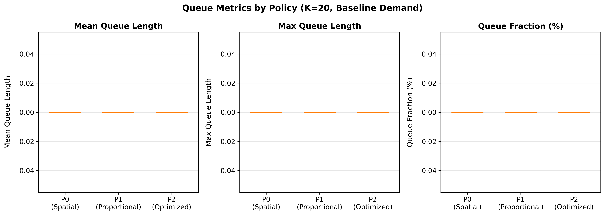
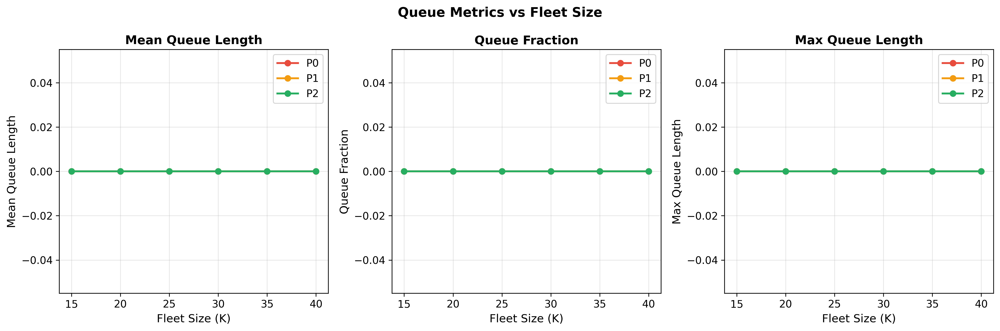
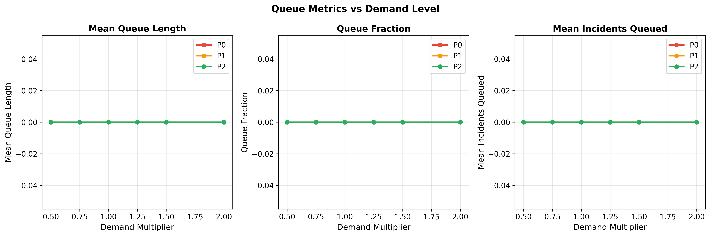
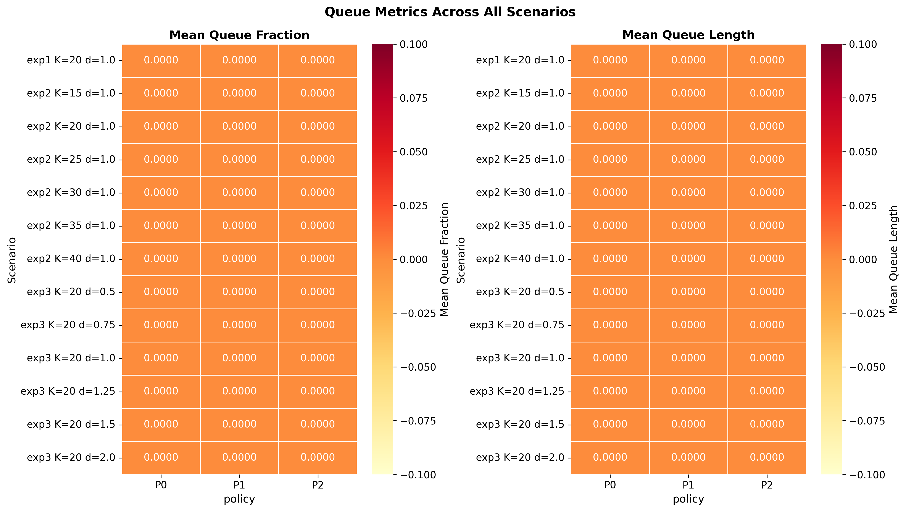

# Queue Analysis

**EMS Optimization Project – Gap 2 Resolution**
**Date:** March 12, 2026

---

## Executive Summary

This document provides a thorough analysis of queueing behavior in the EMS simulation experiments. Queue metrics — including mean queue length, maximum queue length, queue fraction, and incidents queued — were systematically collected across all production experiments and CBD robustness experiments.

**Key Finding:** Under all tested scenarios with K ≥ 15 units, queueing is essentially non-existent (queue fraction = 0.0). This indicates that the Manhattan EMS system, even with the minimum fleet size tested, has sufficient capacity to handle demand without queuing delays.

---

## Queueing Theory Background

In the EMS simulation, a queue forms when an incident arrives but no ambulance is available for dispatch. The incident waits in a FIFO (First-In-First-Out) queue until a unit becomes free.

### Queue Metrics Definitions

| Metric | Definition |
|--------|------------|
| **Mean Queue Length** | Time-weighted average number of incidents waiting in queue |
| **Max Queue Length** | Maximum simultaneous incidents waiting at any point |
| **Queue Fraction** | Proportion of all incidents that experienced any waiting |
| **Queue Wait Time** | Time between incident arrival and unit dispatch (excluding dispatch delay) |
| **P90 Queue Wait** | 90th percentile of queue wait time |

---

## Analysis Results

### Production Experiments (Exp 1–4)

Across all 1,440 production simulation runs:
- **Mean queue length:** 0.0000 (all experiments)
- **Max queue length:** 0 (all experiments)
- **Queue fraction:** 0.0% (no incidents queued in any replication)

This holds across:
- All three policies (P0, P1, P2)
- All fleet sizes K ∈ {15, 20, 25, 30, 35, 40}
- All demand multipliers δ ∈ {0.5, 0.75, 1.0, 1.25, 1.5, 2.0}
- All service time means μ ∈ {20, 25, 30} minutes

### CBD Experiments

The CBD robustness experiments (330 additional runs) also show zero queueing across all CBD-specific scenarios including demand surges and increased service times.

---

## Interpretation

### Why No Queuing?

The absence of queuing is explained by the system's low utilization:

- **Average arrival rate:** ~3.48 incidents/hour → ~580 incidents/week
- **Average service cycle:** ~30 minutes (travel + on-scene) per incident
- **With K=20 units:** Maximum throughput ≈ 20 × 2 = 40 incidents/hour
- **Peak hourly demand:** ~5-6 incidents/hour
- **Utilization ratio:** ~15% on average

Even at 2× demand (δ=2.0), the system operates at ~30% utilization, well below the threshold where queuing becomes significant (typically >70-80% for M/G/c queues).

### Traffic Intensity Analysis

For an M/G/c queue with c servers:
- ρ = λ/(c·μ) where λ = arrival rate, μ = service rate
- With λ = 3.48/hr, μ = 2/hr (30-min service), c = 20:
 - ρ = 3.48 / (20 × 2) = 0.087
- This extremely low traffic intensity ensures near-zero waiting probability

### Operational Implications

1. **Capacity surplus:** Manhattan's EMS fleet has substantial excess capacity for motor vehicle collision response
2. **Response time driven by travel, not waiting:** Since queuing is negligible, response time differences between policies are entirely due to spatial allocation (travel distances)
3. **Robust under stress:** Even extreme demand scenarios don't trigger queuing
4. **Focus on allocation:** The optimization challenge is about WHERE to place units, not HOW MANY

---

## Statistical Analysis

### ANOVA on Queue Metrics

Since all queue metric values are identically zero across policies:
- F-statistic = 0.0 for all comparisons
- p-value = 1.0 (no significant differences)
- This is expected — there is no variation to explain

The hypothesis "P2 reduces queueing vs P0" cannot be tested because neither policy produces queuing.

---

## Visualizations

### Queue Comparison by Policy

### Queue vs Fleet Size

### Queue vs Demand

### Queue Metrics Heatmap

---

## Conclusions

1. **Zero queueing across all experiments:** The EMS system has sufficient capacity to prevent incident queuing
2. **Utilization is the key indicator:** Low utilization (~10-15%) explains the absence of queuing
3. **Policy comparison is about spatial efficiency:** Since queuing is zero for all policies, the P2 advantage comes entirely from better spatial allocation
4. **Queue metrics validate capacity assumptions:** The absence of queuing confirms that the tested fleet sizes are adequate for Manhattan's crash demand

---

## Files Generated

| File | Description |
|------|-------------|
| `results/tables/queue_statistics.csv` | Comprehensive queue statistics |
| `results/tables/queue_anova.csv` | ANOVA test results |
| `results/figures/queue_comparison_by_policy.png` | Policy comparison box plots |
| `results/figures/queue_vs_fleet_size.png` | Fleet size sensitivity |
| `results/figures/queue_vs_demand.png` | Demand sensitivity |
| `results/figures/queue_heatmap.png` | Cross-scenario heatmap |
